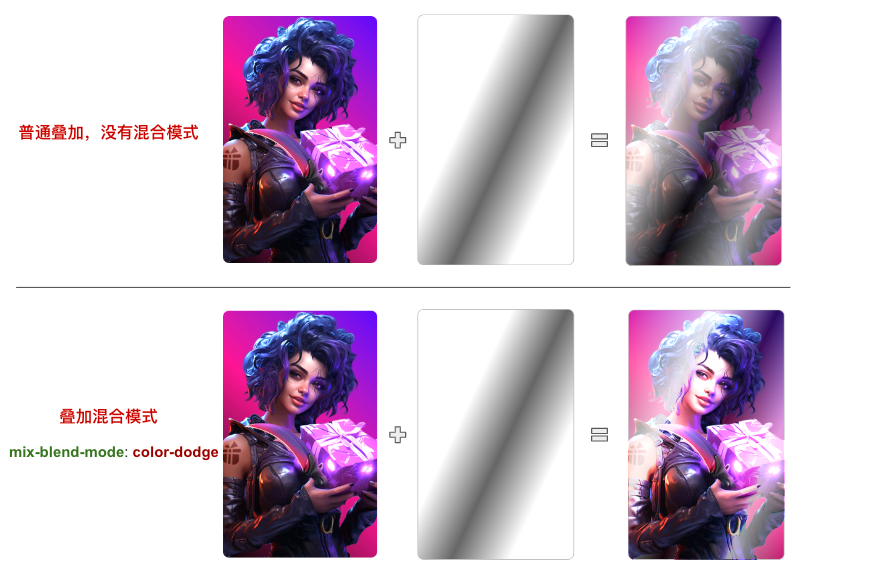

## 看到一个非常有意思酷炫的效果。而本文，我们基于此效果，尝试去制作这么一个类似的卡片交互效果：


### 该效果的几个核心点：

卡片的 3D 旋转跟随鼠标移动效果
如何让卡片在 Hover 状态，有不同的光泽变化
如何让卡片在 Hover 状态，有 Blink，Blink 的星星闪烁效果
当然，要做到卡片的 3D 旋转跟随鼠标移动效果需要一定程度的借助 JavaScript，因此，最终的效果是 CSS 配合 JavaScript 以及一些动态效果的 Gif 共同实现。
好，下面就让我们一步一步一起来实现这个效果。

## 1 卡片的 3D 旋转跟随效果

通过 js 控制鼠标移动，图像跟随旋转
::: demo 示例1
```vue
<template>
  <div class="box" ref="box">
    <div class="content" ref="content"></div>
  </div>
</template>
 <script>
  export default {
    data: () => ({ }),
    mounted(){   
      this.$nextTick(() => 
      {
        this.init();
      })},
    methods: {
    init() {
      const multiple = 20;
      const mouseOverContainer = this.$refs?.box;
      const element = this.$refs?.content;
      function transformElement(x, y) {
        let box = element.getBoundingClientRect();
        let calcX = -(y - box.y - box.height / 2) / multiple;
        let calcY = (x - box.x - box.width / 2) / multiple;
        element.style.transform =
          "rotateX(" + calcX + "deg) " + "rotateY(" + calcY + "deg)";
      }
      mouseOverContainer &&
        mouseOverContainer.addEventListener("mousemove", (e) => {
          window.requestAnimationFrame(function () {
            transformElement(e.clientX, e.clientY);
          });
        });
    },
  },
  }
  </script>
<style>
 .box{
        width: 600px;
        height: 600px;
        transform-style: preserve-3d;
        perspective: 500px;
         padding:70px;
      }

      .content {
        width: 200px;
        height: 200px;
        background: #000;
        transform-style: preserve-3d;
        margin: 200px;
      }
      .content {
        transform: rotateX(15deg) rotateY(30deg);
      }
</style>
:::
 ## 设置平滑出入
 现在，还有最后一个问题，就是当我们的鼠标离开活动区域时，元素的 transform 将停留在最后一帧，正确的表现应该是复原到原状。因此，我们还需要添加一些事件监听做到元素的平滑复位。

通过一个 mouseleave 事件配合元素的 transition 即可。

```js
.content {
    // 与上述保持一致...
    transition: all .2s;
}
```
```js
mouseOverContainer.addEventListener('mouseleave', (e) => {
  window.requestAnimationFrame(function(){
    element.style.transform = "rotateX(0) rotateY(0)";
  });
});
```
## 效果
::: demo 示例2
```vue
<template>
  <div class="box2" ref="box2">
    <div class="content2" ref="content2"></div>
  </div>
</template>
 <script>
  export default {
    data: () => ({ }),
    mounted(){   
      this.$nextTick(() => 
      {
        this.init();
      })},
    methods: {
    init() {
      const multiple = 20;
      const mouseOverContainer = this.$refs?.box2;
      const element = this.$refs?.content2;
      function transformElement(x, y) {
        let box = element.getBoundingClientRect();
        let calcX = -(y - box.y - box.height / 2) / multiple;
        let calcY = (x - box.x - box.width / 2) / multiple;
        element.style.transform =
          "rotateX(" + calcX + "deg) " + "rotateY(" + calcY + "deg)";
      }
      mouseOverContainer &&
        mouseOverContainer.addEventListener("mousemove", (e) => {
          window.requestAnimationFrame(function () {
            transformElement(e.clientX, e.clientY);
          });
        });
      mouseOverContainer && mouseOverContainer.addEventListener('mouseleave', (e) => {
      window.requestAnimationFrame(function(){
        element.style.transform = "rotateX(0) rotateY(0)";
      });
});
    },
  },
  }
  </script>
<style>
 .box2{
        width: 600px;
        height: 600px;
        transform-style: preserve-3d;
        perspective: 500px;
        box-sizing: border-box;
        padding:70px;
      }

      .content2 {
        width: 200px;
        height: 200px;
        background: #000;
        box-sizing: border-box;
        transform-style: preserve-3d;
        transition: all .2s;
        margin: 200px;
      }
      .content2 {
        transform: rotateX(15deg) rotateY(30deg);
      }
</style>
:::

## Hover 状态下的光泽变化
好，有了上述铺垫之后，我们就可以将黑色背景图，替换成实际的图片，得到这么一个初步效果：
::: demo 示例3
```vue
<template>
  <div class="box3" ref="box3">
    <div class="content3" ref="content3"></div>
  </div>
</template>
 <script>
  export default {
    data: () => ({ }),
    mounted(){   
      this.$nextTick(() => 
      {
        this.init();
      })},
    methods: {
    init() {
      const multiple = 20;
      const mouseOverContainer = this.$refs?.box3;
      const element = this.$refs?.content3;
      function transformElement(x, y) {
        let box = element.getBoundingClientRect();
        let calcX = -(y - box.y - box.height / 2) / multiple;
        let calcY = (x - box.x - box.width / 2) / multiple;
        element.style.transform =
          "rotateX(" + calcX + "deg) " + "rotateY(" + calcY + "deg)";
      }
      mouseOverContainer &&
        mouseOverContainer.addEventListener("mousemove", (e) => {
          window.requestAnimationFrame(function () {
            transformElement(e.clientX, e.clientY);
          });
        });
      mouseOverContainer && mouseOverContainer.addEventListener('mouseleave', (e) => {
      window.requestAnimationFrame(function(){
        element.style.transform = "rotateX(0) rotateY(0)";
      });
});
    },
  },
  }
  </script>
<style>
 .box3{
        width: 600px;
        height: 600px;
        transform-style: preserve-3d;
        perspective: 500px;
        box-sizing: border-box;
        padding:70px;
      }

      .content3 {
        width: 200px;
        height: 200px;
        position: relative;
        background: url('https://key-drop.com/cdn-cgi/image/format=auto,width=270,dpr=2/uploads/skins/JAINA.png');
        background-size: cover;
        background-position: center;
        border-radius: 10px;
        box-sizing: border-box;
        transform-style: preserve-3d;
        transition: all .2s;
        margin: 200px;
      }
      .content3 {
        transform: rotateX(15deg) rotateY(30deg);
      }
</style>
:::

### 添加混合光泽和动画效果
混合
```css
div {
    position: relative;
    background: url('image.png');
    
    &::before {
        content: "";
        position: absolute;
        inset: 0;
        background: 
            linear-gradient(
                115deg, 
                transparent 0%, 
                rgba(255, 255, 255, 0.5 30%), 
                rgba(0, 0, 0, .5) 55%), 
                rgba(255, 255, 255, .5) 80%), 
                transparent 100%
            );
        mix-blend-mode: color-dodge;
    }
}

```
这里，我们利用 div 元素的背景展示了图片，利用元素的伪元素展示了黑白渐变效果，最终再叠加上混合模式 mix-blend-mode: color-dodge，示意图如下：


但是，此时，只有卡片是有 3D 效果的，叠加的黑白渐变层是不会随着 Hover 效果进行变化的：
为了解决这个问题，我们需要让渐变图层也能受到 Hover 的动态影响，这个好做，我们额外引入一个 CSS 变量，基于鼠标当前 Hover 卡片时，距离卡片最左侧的横向距离，设置动态的 CSS 变量。
```js
<div id="g-img"></div>
```
```js
div {
    --per: 30%;
    position: relative;
     // ...
    
    &::before {
        content: "";
        position: absolute;
        inset: 0;
        background: 
            linear-gradient(
                115deg, 
                transparent 0%, 
                rgba(255, 255, 255, 0.5) var(--per), 
                rgba(0, 0, 0, .5) calc(var(--per) + 25%), 
                rgba(255, 255, 255, .5) calc(var(--per) + 50%), 
                transparent 100%
            );
        mix-blend-mode: color-dodge;
    }
}
```
```js
const multiple = 15;
const mouseOverContainer = document.getElementsByTagName("body")[0];
const element = document.getElementById("element");
const img = document.getElementById("g-img");

function transformElement(x, y) {
    let box = element.getBoundingClientRect();
    const calcX = -(y - box.y - box.height / 2) / multiple;
    const calcY = (x - box.x - box.width / 2) / multiple;
    const percentage = parseInt((x - box.x) / box.width * 1000) / 10;
    
    element.style.transform = "rotateX(" + calcX + "deg) " + "rotateY(" + calcY + "deg)";

    // 额外增加一个控制 --per 的变量写入
    img.style = `--per: ${percentage}%`;
}

mouseOverContainer.addEventListener("mousemove", (e) => {
    window.requestAnimationFrame(function () {
        transformElement(e.clientX, e.clientY);
    });
});
```
简单解释一下，上述代码最核心的部分就是引入了 --per CSS 变量，其应用在渐变代码中。

我们通过计算当前鼠标距离卡片左侧的横向距离，除以卡片整体的宽度，得到 --per 实际表示的百分比，再赋值给 --per，以此实现 Hover 时候的光效变化：

## 叠加星星闪烁效果

我们可以在这一步，继续叠加上另外一层星星闪烁的效果，添加一个hover悬浮显示效果，使用现有的gif
```js
#g-img {
    --per: 30%;
    position: relative;
    background: url('image.png');
    
    &::after {
        content: "";
        display: none;
        position: absolute;
        inset: 0;
        background: url("https://s3-us-west-2.amazonaws.com/s.cdpn.io/13471/sparkles.gif");
        mix-blend-mode: color-dodge;
    }
    
    &::before {
        content: "";
        display: none;
        position: absolute;
        background: 
            linear-gradient(
                115deg, 
                transparent 0%, 
                rgba(255, 255, 255, 0.7) var(--per), 
                rgba(0, 0, 0, .6) calc(var(--per) + 25%), 
                rgba(255, 255, 255, .5) calc(var(--per) + 50%), 
                transparent 100%
            );
        mix-blend-mode: color-dodge;
    }
    
    &:hover::after,
    &:hover::before {
        display: block;
    }
}
```
## 最终效果图
::: demo
```vue
<template>
 <div ref="mybody" class="mybody"> 
   <div id="element" ref="element">
    <div id="g-img" ref="gimg"></div>
</div>
 </div>
</template>
 <script>
  export default {
    data: () => ({ }),
    mounted(){   
      this.$nextTick(() => 
      {
        this.init();
      })},
    methods: {
    init() {
     const multiple = 15;
      const mouseOverContainer = this.$refs?.mybody;
      const element = this.$refs?.element;
      const img =  this.$refs?.gimg;

      function transformElement(x, y) {
          let box = element.getBoundingClientRect();
          const calcX = -(y - box.y - box.height / 2) / multiple;
          const calcY = (x - box.x - box.width / 2) / multiple;
          const percentage = parseInt((x - box.x) / box.width * 1000) / 10;
          
          element.style.transform = "rotateX(" + calcX + "deg) " + "rotateY(" + calcY + "deg)";
          img.style = `--per: ${percentage}%`;
      }

      mouseOverContainer.addEventListener("mousemove", (e) => {
          window.requestAnimationFrame(function () {
              transformElement(e.clientX, e.clientY);
          });
      });

      mouseOverContainer.addEventListener("mouseleave", (e) => {
          window.requestAnimationFrame(function () {
              element.style.transform = "rotateX(0) rotateY(0)";
          });
      });

    },
  },
  }
  </script>
<style>

.mybody {
    width: 300px;
    height: 400px;
    display: flex;
    transform-style: preserve-3d;
    perspective: 500px;
    cursor: pointer;
}

#element {
    margin: auto;
    width: 150px;
    height: 250px;
    background: linear-gradient(45deg, black, deeppink, #6006ff);
    border-radius: 10px;
    transform-style: preserve-3d;
    transition: all .1s;
}

#g-img {
    --per: 30%;
    position: relative;
    width: 100%;
    height: 100%;
    background: url('https://key-drop.com/cdn-cgi/image/format=auto,width=270,dpr=2/uploads/skins/JAINA.png');
    background-size: cover;
    background-position: center;
    border-radius: 10px;
    filter: brightness(1.2);
    
    &::after {
        content: "";
        display: none;
        position: absolute;
        inset: 0;
        border-radius: 10px;
        background: url("https://s3-us-west-2.amazonaws.com/s.cdpn.io/13471/sparkles.gif");
        mix-blend-mode: color-dodge;
    }
    
    &::before {
        content: "";
        display: none;
        position: absolute;
        inset: 0;
        border-radius: 10px;
        background: 
            linear-gradient(
                115deg, 
                transparent 0%, 
                rgba(255, 255, 255, 0.7) var(--per), 
                rgba(0, 0, 0, .6) calc(var(--per) + 25%), 
                rgba(255, 255, 255, .5) calc(var(--per) + 50%), 
                transparent 100%
            );
        mix-blend-mode: color-dodge;
    }
    
    &:hover::after,
    &:hover::before {
       display: block;
    }
}
</style>
:::