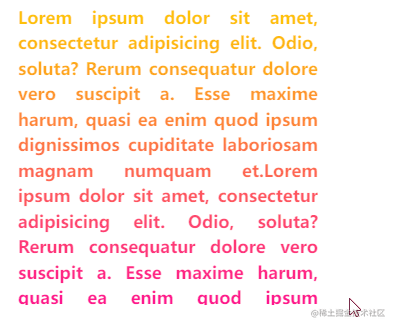

## 强大的 Mask
首先，我们需要用到 Mask。

在 CSS 中，mask 属性允许使用者通过遮罩或者裁切特定区域的图片的方式来隐藏一个元素的部分或者全部可见区域。

使用 mask 实现 hover 隐藏图片

````html
<div class="img"></div>
````

````css
div {
    width: 300px;
    height: 300px;
    background: url(image.jpg);
}
.img:hover {
    mask: linear-gradient(rgba(0, 0, 0, 0), rgba(0, 0, 0, 0));
}
````
是的，利用 Mask，我们同样也可以得到近似的消失效果：   


当然，对于现在这个效果，有个很大的缺陷，那就是缺少了动画。图片是瞬间消失的。所以，我们还需要给上述的借助 mask 实现的图片消失效果添加上动画。

而这，就需要用上 CSS @property 了。

## 强大的 CSS @property
CSS @property，大家应该不那么陌生了。
@property CSS at-rule 是 CSS Houdini API 的一部分, 它允许开发者显式地定义他们的 CSS 自定义属性，允许进行属性类型检查、设定默认值以及定义该自定义属性是否可以被继承。

借助，CSS @property，我们改造一下代码：

````css
@property --m-0 {
   syntax: "<number>";
   initial-value: 1;
   inherits: false;
}
div {
    width: 300px;
    height: 300px;
    background: url(image.jpg);
    mask: linear-gradient(90deg, rgba(0, 0, 0, var(--m-0)), rgba(0, 0, 0, var(--m-0)));
    transition: --m-0 0.5s;
}
div:hover {
    --m-0: 0;
}

````
用这个小技巧，我们就可以成功的实现基于 mask 属性的动画效果：<br>


## 借助多重 mask 分割图片
到了这一步，后面的步骤其实就很明朗了。
由于 mask 拥有和 background 一样的特性。因此，mask 是可以有多重 mask 的。也就是说，我们可以设置多个不同的 mask 效果给同一个元素。
什么意思呢？上面的效果只有一重 mask，我们稍微添加一些 mask 代码，让它变成 2 重 mask：

````css
@property --m-0 {
   syntax: "<number>";
   initial-value: 1;
   inherits: false;
}
@property --m-1 {
   syntax: "<number>";
   initial-value: 1;
   inherits: false;
}
div {
    mask: 
        linear-gradient(90deg, rgba(0, 0, 0, var(--m-0)), rgba(0, 0, 0, var(--m-0))),
        linear-gradient(90deg, rgba(0, 0, 0, var(--m-1)), rgba(0, 0, 0, var(--m-1)));
    mask-size: 50% 100%;
    mask-position: left, right;
    mask-repeat: no-repeat;
    transition: 
        --m-0 0.3s,
        --m-1 0.25s 0.15s;
}
div:hover {
    --m-0: 0;
    --m-1: 0;
}
````
这样，我们的步骤大概是：

首先将 mask 一分为二，左右两边各一个
然后，设置了两个基于 CSS @property 的变量，--m-0 和 --m-0
然后，给它们设置了不同的过渡时间和过渡延迟时间
在 hover 的一瞬间，再将这两个变量的值，都置为 0，也就是实现 linear-gradient(90deg, rgba(0, 0, 0, 1), rgba(0, 0, 0, 1)) 到 linear-gradient(90deg, rgba(0, 0, 0, 0), rgba(0, 0, 0, 0)) 的变化，用于隐藏对应 mask 块
由于设置了不同的过渡时间和延迟时间，整体上看上去，整个动画就分成了两部分<br>


继续切割为 4 重 mask
```css
@property --m-0 {
   syntax: "<number>";
   initial-value: 1;
   inherits: false;
}
@property --m-1 {
   syntax: "<number>";
   initial-value: 1;
   inherits: false;
}
@property --m-2 {
   syntax: "<number>";
   initial-value: 1;
   inherits: false;
}
@property --m-3 {
   syntax: "<number>";
   initial-value: 1;
   inherits: false;
}
div {
    mask: 
        linear-gradient(90deg, rgba(0, 0, 0, var(--m-0)), rgba(0, 0, 0, var(--m-0))),
        linear-gradient(90deg, rgba(0, 0, 0, var(--m-1)), rgba(0, 0, 0, var(--m-1))),
        linear-gradient(90deg, rgba(0, 0, 0, var(--m-2)), rgba(0, 0, 0, var(--m-2))),
        linear-gradient(90deg, rgba(0, 0, 0, var(--m-3)), rgba(0, 0, 0, var(--m-3)));
    mask-size: 50% 50%;
    mask-repeat: no-repeat;
    mask-position: left top, right top, left bottom, bottom right;
    transition: 
        --m-0 0.3s,
        --m-1 0.15s 0.1s,
        --m-2 0.25s 0.21s,
        --m-3 0.19s 0.15s;
}
div:hover {
    --m-0: 0;
    --m-1: 0;
    --m-2: 0;
    --m-3: 0;
}
```
这样，我们就可以得到 4 块分割图片的 mask 消失效果：<br>


## 基于 SCSS 简化代码
那么，如果我们要分割为 100 块呢？或者 400 块呢？还要手写这些代码吗？

当然不需要，由于上面的代码的规律非常的明显，我们可以借助预处理器很好的封装整个效果。从而快速的实现切割成任意规则块数的效果。

完整的代码如下：
```css
body, html {
    width: 100%;
    height: 100%;
    display: flex;
}

$count: 400;
$sqrt: 20;
$per: 100% / $sqrt;
$width: 300px;
$perWid: 15;

@for $i from 1 to ($count + 1) {
    @property --m-#{$i} {
       syntax: "<number>";
       initial-value: 1;
       inherits: false;
    }
}

@function bgSet($n) {
    $bg : radial-gradient(rgba(0, 0, 0, var(--m-1)), rgba(0, 0, 0, var(--m-1)));
    
    @for $i from 2 through $n {         
        $bg: $bg, radial-gradient(rgba(0, 0, 0, var(--m-#{$i})), rgba(0, 0, 0, var(--m-#{$i})));
    }
    
    @return $bg;
}

@function positionSet($n) {
    $bgPosition: ();

    @for $i from 0 through ($n) {   
        @for $j from 0 through ($n - 1) {  
            $bgPosition: $bgPosition, #{$i * $perWid}px #{$j * $perWid}px;
        }
    }
    
    @return $bgPosition;
}

@function transitionSet($n) {
    $transition: --m-1 0.1s 0.1s;

    @for $i from 1 through $n {   
        $transition: $transition, --m-#{$i} #{random(500)}ms #{random(500)}ms;
    }
    
    @return $transition;
}

div {
    width: $width;
    height: $width;
    background: url(https://picsum.photos/800/800?random=100);
    background-size: cover;
    background-position: center center;
    cursor:pointer;
    margin: auto;
}

div {
    mask: bgSet($count);
    mask-size: $per $per;
    mask-repeat: no-repeat;
    mask-position: positionSet($sqrt); 
    transition: transitionSet($count);
}

div:hover {
    @for $i from 1 through $count {         
        --m-#{$i}: 0;
    }
}
```
这里，简单解释一下，以生成 400 块小块为例子：

最上面的 SCSS 变量定义中，

$count 是我们最终生成的块数
$sqrt 是每行以及每列会拥有的块数
$per 是每一块占整体图片元素的百分比值
$width 是整个图片的宽高值
$perWid 是每一块的宽高值


利用了最上面的一段循环函数，批量的生成 CSS @property 变量，从 --m-0 到 --m-400
@function bgSet($n) {} 是生成 400 块 mask 片段
@function positionSet($n) 是生成 400 块 mask 的 mask-position，也就是生成 400 段不同定位，让 400 块 mask 刚好覆盖整个图片
@function transitionSet($n) {} 是随机设置每个块的动画时间和延迟时间
代码最下面，还有一段循环函数，生成 400 个 CSS @property 变量的 hover 值，当 hover 的时候，全部变成 0

这样，我们就实现了 400 分块的渐隐效果。效果如下：<br>

## 调整过渡变量，控制方向
当然，上面我们的对每一个小块的 transition 的过渡时间和过渡延迟时间的设置，都是随机的：
````css
<div class="three"></div>

body, html {
    width: 100%;
    height: 100%;
    display: flex;
}

$count: 400;
$sqrt: 20;
$per: 100% / $sqrt;
$width: 300px;
$perWid: 15;

@for $i from 1 to ($count + 1) {
    @property --m-#{$i} {
       syntax: "<number>";
       initial-value: 1;
       inherits: false;
    }
}

@function bgSet($n) {
    $bg : radial-gradient(rgba(0, 0, 0, var(--m-1)), rgba(0, 0, 0, var(--m-1)));
    
    @for $i from 2 through $n {         
        $bg: $bg, radial-gradient(rgba(0, 0, 0, var(--m-#{$i})), rgba(0, 0, 0, var(--m-#{$i})));
    }
    
    @return $bg;
}

@function positionSet($n) {
    $bgPosition: ();

    @for $i from 0 through ($n) {   
        @for $j from 0 through ($n - 1) {  
            $bgPosition: $bgPosition, #{$i * $perWid}px #{$j * $perWid}px;
        }
    }
    
    @return $bgPosition;
}

@function transitionSet($n) {
    $transition: --m-1 0.1s 0.1s;

    @for $i from 1 through $n {   
        $transition: $transition, --m-#{$i} #{100 + random(500)}ms #{($i / 50) * random(100)}ms;
    }
    
    @return $transition;
}

div {
    width: $width;
    height: $width;
    background: url(https://picsum.photos/600/600?random=104);
    background-size: cover;
    background-position: center center;
    cursor:pointer;
    margin: auto;
}

.three {
    mask: bgSet($count);
    mask-size: $per $per;
    mask-repeat: no-repeat;
    mask-position: positionSet($sqrt); 
    transition: transitionSet($count);
}

div:hover {
    @for $i from 1 through $count {         
        --m-#{$i}: 0;
    }
}
````
那么，整个动画的方向就是从左往右逐渐消失：<br>


当然，有意思的是，这个效果，不仅仅能够运用在图片上，它其实可以作用在任何元素之上！
````html
<div>Lorem ipsum dolor sit amet, consectetur adipisicing elit. Odio, soluta? Rerum consequatur dolore vero suscipit a. Esse maxime harum, quasi ea enim quod ipsum dignissimos cupiditate laboriosam magnam numquam et.Lorem ipsum dolor sit amet, consectetur adipisicing elit. Odio, soluta? Rerum consequatur dolore vero suscipit a. Esse maxime harum, quasi ea enim quod ipsum dignissimos cupiditate laboriosam magnam numquam et.Lorem ipsum dolor sit amet, consectetur adipisicing elit. Odio, soluta? Rerum consequatur dolore vero suscipit a. Esse maxime harum, quasi ea enim quod ipsum dignissimos cupiditate laboriosam magnam numquam et.</div>
````
````css
body, html {
    width: 100%;
    height: 100%;
    display: flex;
}

$count: 400;
$sqrt: 20;
$per: 100% / $sqrt;
$width: 300px;
$perWid: 15;

@for $i from 1 to ($count + 1) {
    @property --m-#{$i} {
       syntax: "<number>";
       initial-value: 1;
       inherits: false;
    }
}

@function bgSet($n) {
    $bg : radial-gradient(rgba(0, 0, 0, var(--m-1)), rgba(0, 0, 0, var(--m-1)));
    
    @for $i from 2 through $n {         
        $bg: $bg, radial-gradient(rgba(0, 0, 0, var(--m-#{$i})), rgba(0, 0, 0, var(--m-#{$i})));
    }
    
    @return $bg;
}

@function positionSet($n) {
    $bgPosition: ();

    @for $i from 0 through ($n) {   
        @for $j from 0 through ($n - 1) {  
            $bgPosition: $bgPosition, #{$i * $perWid}px #{$j * $perWid}px;
        }
    }
    
    @return $bgPosition;
}

@function transitionSet($n) {
    $transition: --m-1 0.1s 0.1s;

    @for $i from 1 through $n {   
        $transition: $transition, --m-#{$i} #{random(500)}ms #{random(500)}ms;
    }
    
    @return $transition;
}

div {
    width: $width;
    height: $width;
    background-size: cover;
    background-position: center center;
    cursor:pointer;
    margin: auto;
    overflow: hidden;
    text-align: justify;
    line-height: 1.5;
    font-size: 17px;
    font-weight: bold;
    background: linear-gradient(#fc0, deeppink);
    background-clip: text;
    color: transparent;
}

div {
    mask: bgSet($count);
    mask-size: $per $per;
    mask-repeat: no-repeat;
    mask-position: positionSet($sqrt); 
    transition: transitionSet($count);
}

div:hover {
    @for $i from 1 through $count {         
        --m-#{$i}: 0;
    }
}
````


## 总结
到这里，简单总结一下。本文，我们核心利用了 CSS @propery 和 mask，实现了一些原本看上去需要非常多 div 才能实现或者是需要借助 Canvas 才能实现的效果。同时，我们借助了 SCSS 预处理器，在寻找到规律后，极大的简化了 CSS 代码的书写量。