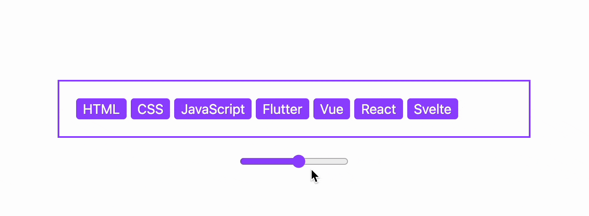

## 纯 CSS 实现多标签自动显示超出数量

```js
<!DOCTYPE html>
<html lang="en">
  <head>
    <title></title>
    <meta charset="UTF-8">
    <meta name="viewport" content="width=device-width, initial-scale=1">
    <link href="css/style.css" rel="stylesheet">
    <style>
      html,body{
        font-family: -apple-system, "BlinkMacSystemFont", sans-serif;
        margin: 0;
        height: 100%;
        display: flex;
        justify-content: center;
        flex-direction: column;
        align-items: center;
        background: #fff;
        gap: 20px;
        accent-color: #9747FF;
      }
      .wrap{
        width: 300px;
        display: flex;
        align-items: center;
        padding: 15px;
        outline: 2px solid #9747FF;
        gap: 5px;
        overflow: hidden;
      }
      .con{
        position: relative;
        display: flex;
        gap: 5px;
        padding: 5px;
        overflow: hidden;
        counter-reset: num;
        animation: check;
        animation-timeline: scroll(x self);
        margin-right: -46px;
      }
      @keyframes check{
        from,to {
          margin-right: 0;
          -webkit-mask: linear-gradient(to right, #fff calc(100% - 30px), transparent);
        }
      }
      .wrap::after{
        content: "+"counter(num);
        padding: .2em .5em;
        background-color: #FFE8A3;
        color: #191919;
        border-radius: 4px;
      }
      .tag{
        padding: .2em .5em;
        background-color: #9747FF;
        color: #fff;
        border-radius: 4px;
        counter-increment: num 1;
        animation: appear;
        animation-timeline: view(inline);
        animation-range: contain;
      }
      @keyframes appear{
        from,to {
          counter-increment: num 0;
        }
      }
    </style>
  </head>
  <body>
    <h3>CSS 标签超出显示数量</h3>
    <div class="wrap">
      <div class="con">
        <a class="tag">HTML</a>
        <a class="tag">CSS</a>
        <a class="tag">JavaScript</a>
        <a class="tag">Flutter</a>
        <a class="tag">Vue</a>
        <a class="tag">React</a>
        <a class="tag">Svelte</a>
      </div>
    </div>
    <input type="range" min="200" value="300" max="800" oninput="this.previousElementSibling.style.width = this.value + 'px'">
  </body>
</html>
```