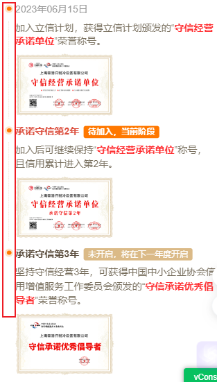

## 要实现一个自定义导航栏
如下


### 通过伪元素 ::before 和 ::after实现
```js
<div class="signpay-steps">
              <div class="content">
                <div>
                  <div class="node show-time">{{ companyInfo.origin_start_date }}</div>
                  <div class="borderLeft borderLeft1"></div>
                </div>
                <div class="two">
                  <div class="name">加入立信计划，获得立信计划颁发的“<span>守信经营承诺单位</span>”荣誉称号。</div>
                  <div class="showimg" >
                    <div class="pay-first">
                      <div @click="showCredit('1')">
                        
                      </div>
                      <div class="company-name">{{ companyInfo.company_name }}</div>
                    </div>
                  </div>
                </div>
              </div>
              <!-- 第二年 -->
              <div class="content">
                <div>
                  <div v-if="credit_year=='2'" class="node show-type">承诺守信第2年<span class="current-time">待加入，当前阶段</span></div>
                  <div v-if="credit_year=='3'" class="node show-type show-type2">承诺守信第2年</div>
                  <div class="borderLeft borderLeft1"></div>
                </div>
                <div class="two">
                  <div class="name">加入后可继续保持“<span>守信经营承诺单位</span>”称号，且信用累计进入第2年。</div>
                  <div class="showimg" >
                    <div class="pay-first">
                      <div @click="showCredit('2')">
                        
                      </div>
                      <div class="company-name">{{ companyInfo.company_name }}</div>
                    </div>
                  </div>
                </div>
              </div>
              <!-- 第三年 -->
              <div class="content">
                <div>
                  <div v-if="credit_year=='2'" class="node show-type show-type2">承诺守信第3年<span class="next-time">未开启，将在下一年度开启</span></div>
                  <div v-if="credit_year=='3'" class="node show-type">承诺守信第3年<span class="current-time">待加入，当前阶段</span></div>
                  <div class="borderLeft borderLeft1"></div>
                </div>
                <div class="two">
                  <div class="name">坚持守信经营3年，可获得中国中小企业协会信用增值服务工作委员会颁发的“<span>守信承诺优秀倡导者</span>”荣誉称号。</div>
                  <div class="showimg" >
                    <div class="pay-first">
                      <div @click="showCredit('3')">
                        
                      </div>
                      <div class="company-name company-name2">{{ companyInfo.company_name }}</div>
                    </div>
                  </div>
                </div>
              </div>
        </div>

        ...

    //css
    .signpay-steps{
      padding: 41px 46px;
      .content {
        list-style: none;
        box-sizing: border-box;
        padding-left: 27px;
        position: relative;
        .borderLeft {
          width: 3px;
          position: absolute;
          top: 80px;
          bottom: 0;
          left: -0.7px;
        }
      }
    .borderLeft1 {
        border-left: 1px dotted #f3ddc9;;
      }

      .node::before {
        z-index: 2;
        content: "";
        width: 19px;
        height: 19px;
        background-color: #ff7800;
        position: absolute;
        border-radius: 50%;
        left: 0;
        top: 28px;
        transform: translate(-50%, -50%);
      }
      .node::after {
        z-index: 1;
        content: "";
        width: 36px;
        height: 36px;
        background-color: #ff7800;
        position: absolute;
        border-radius: 50%;
        left: 0;
        top: 28px;
        transform: translate(-50%, -50%);
        opacity: 0.2;
      }

      .node {
      	font-size: 42px;
        font-weight: normal;
        font-stretch: normal;
        letter-spacing: 0px;
        color: #79705f;
      }

      .show-time {
        color: #999999;
      }
      .show-type{
        font-size: 42px;
        font-weight: bold;
        font-stretch: normal;
        letter-spacing: 0px;
        color: #dc503f;
      }
      .show-type2{
        color: #5a4c3c;
      }
      .current-time{
        display: inline-block;
        padding: 0px 20px;
        height: 53px;
        background-color: #ff7800;
        border-radius: 9px;
        font-size: 36px;
        font-weight: bold;
        font-stretch: normal;
        letter-spacing: 0px;
        color: #ffffff;
        text-align: center;
        margin-left: 18px;
      }
      .next-time{
        display: inline-block;
        height: 53px;
        padding: 0px 20px;
        background-color: #dbba87;
        border-radius: 9px;
        font-size: 36px;
        font-weight: normal;
        font-stretch: normal;
        letter-spacing: 0px;
        color: #ffffff;
        text-align: center;
        margin-left: 18px;
      }

      .node1::before {
        background-color: #ff7800;
      }
    }

    .two {
      .name {
        padding: 23px 0px 23px 0;
        font-size: 42px;
        font-weight: normal;
        font-stretch: normal;
        line-height: 60px;
        letter-spacing: 0px;
        color: #79705f;
        span{
          font-weight: bold;
          color: #ff2e31;
        }
      }

      .showimg {
        margin-bottom: 25px;
        .pay-first{
          position: relative;
          img{
            width: 424px;
	          height: 269px;
          }
          .company-name{
            width: 360px;
            font-size: 16px;
            font-weight: bold;
            font-stretch: normal;
            letter-spacing: 0px;
            color: #000000;
            opacity: 0.9;
            text-align: center;
            position: absolute;
            top: 70px;
            left: 30px;
            white-space: nowrap;
            text-overflow: ellipsis;
            overflow: hidden;
          }
          .company-name2{
            top: 85px;
          }
        }
      }
    }

    .content:last-child .borderLeft {
      display: none;
    }
```