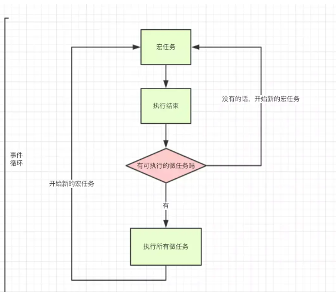

# 代码背景

基于一次线上环境的卡顿事故，客户数据体量过大导致的页面卡顿甚至页面直接崩溃的问题。现在我们将会把此次事故抽象成为大家更好理解的案例，从而来进行分析和解决。

同时希望大家在阅读完之后可以了解到页面卡顿背后的底层原因，还有任务切片的解决原理！


```javascript
<body>
    <input type="text">
    <button id="my-button">执行任务</button>
    <!-- box容器 -->
    <div id="box" style="height:500px;width:400px;overflow: auto;margin-top:24px;">
</body>
```

```javascript
// box容器溢出滚动
const box = document.getElementById('box')
for(let i=0;i<1000;i++){
    const myText = document.createElement('h2')
    myText.innerText = i
    box.appendChild(myText)
}

// 执行任务
const myButton = document.getElementById('my-button')
myButton.addEventListener('click',load)
function load() {
  const total = 300000;
  for (let i = 0; i < total; i++) {
      console.log(i)
  }
}
```

点击执行任务按钮会发现，我们不仅不能和输入框进行交互，连box容器区域的滚动也不再有响应，整个页面卡顿住了，直到load任务执行完成，页面才恢复响应，输入框才能正常使用，box容器区域也能正常响应滚动。

## 长任务执行导致页面卡顿，使用任务切片的方式解决！

任务切片解决卡顿问题的底层原理是什么样子的？或者说什么是卡顿问题，而任务切片又是如何解决这类问题的？

# 卡顿分析

保证页面的流畅性是前端的一个主要内容，页面卡顿会严重影响用户体验。这流畅性是需要一个指标来衡量的，那就是帧率（FPS），FPS 表示的是每秒钟画面更新次数，当今大多数设备的屏幕刷新率都是60次/秒。

## 不同帧率的体验

帧率能够达到 50 ～ 60 FPS 的动画将会相当流畅，让人倍感舒适；
帧率在 30 ～ 50 FPS 之间的动画，因人敏感程度不同，舒适度因人而异；
帧率在 30 FPS 以下的动画，让人感觉到明显的卡顿和不适感；
帧率波动很大的动画，亦会使人感觉到卡顿

也就是说想要保证页面流畅不卡顿，浏览器对每一帧画面的渲染工作需要在16ms（1000ms/60）之内完成！
想要保证页面流畅，需要做到每16ms渲染一次！

也就是说，前面在我们执行任务的时候，浏览器没有能够做到每16ms渲染一次，所以我们页面会卡顿不流畅。那么是什么导致了浏览器没有能够正常渲染呢？或许在探索真相之前，我们还需要先深入了解一下浏览器的事件循环机制！

# 浏览器事件循环机制

浏览器事件循环机制是一种用于处理异步任务的机制。它的工作原理是不断地检查任务队列，执行队列中的任务，并等待新的任务加入。

1 如图



2 进入Update the rendering阶段，这里有个rendering opportunity概念，浏览上下文渲染会根据屏幕刷新率、页面性能、页面是否在后台来确定是否需要渲染。而且渲染间隔通常是固定的。

3 如果不需要渲染，以下步骤（只列举常用的）也不会运行了：

run the resize steps，触发 resize 事件；
run the scroll steps，触发 scroll 事件；
update animations，触发animation相关事件;
run the fullscreen steps，执行 requestFullscreen 等 api；
run the animation frame callbacks，执行 requestAnimationFrame 回调；
run IntersectionObserver callbacks，图片懒加载经常使用；

4 重新渲染用户界面。

5 判断宏任务队列或者微任务队列是否为空，如果为空则执行 Idle 空闲周期计算，判断是否需要执行 requestIdleCallback 的回调。

# 任务切片（setTimeout、requestAnimationFrame）

一般我们可以使用setTimeout或者requestAnimationFrame实现任务切片，这里我们使用setTimeout举例说明：

```javascript
    let total = 1000000;
    let length = 20;
    let page = total/length
    let index = 0;
    function loop(curTotal,curIndex){
        if(curTotal <= 0){
            return false;
        }
        let pageCount = Math.min(curTotal , length);
        setTimeout(()=>{
            for(let i = 0; i < pageCount; i++){
                console.log(i)
            }
            loop(curTotal - pageCount,curIndex + pageCount)
        },0)
    }
    loop(total,index);
  }
```

此时我们运行代码之后发现，点击执行任务按钮时，页面不再卡顿，输入框能够正常focus交互，box容器区域也能正常滚动，一整个流畅！
