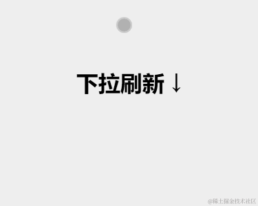

## h5下拉刷新
分为三步：开始下拉时，屏幕顶部会出现加载动画；加载过程中，屏幕顶部高度保持不变；加载完成后，加载动画隐藏。
  
我们把 box 元素当作容器，把 loader-box，loader-box + loading 元素当作动画，至于 h1 元素不需要关注，我们只把它当作操作提示。
```html
<div id="box">
  <div class="loader-box">
    <div id="loading"></div>
  </div>
  <h1>下拉刷新 ↓</h1>
</div>
```
loader-box 的高度是 80px，按上一节原理中的分析，初始时我们需要让 loader-box 位于视口上方，因此 CSS 代码中我们需要把它的位置向上移动 80px。
```css
.loader-box {
  position: relative;
  top: -80px;
  height: 80px;
}
```

loader-box 中的 loader 是纯 CSS 的加载动画。我们利用 border 画出的一个圆形边框，左、上、右边框是浅灰色，下边框是深灰色：
```css
#loader {
  width: 25px;
  height: 25px;
  border: 3px solid #ddd;
  border-radius: 50%;
  border-bottom: 3px solid #717171;
  transform: rotate(0deg);
}
```

开始刷新时，我们给 loader 元素增加一个动画，让它从 0 度到 360 度无限旋转，就实现了加载动画：
```css
#loader.loading {
  animation: loading 1s linear infinite;
}

@keyframes loading {
  from { transform: rotate(0deg); }
  to { transform: rotate(360deg); }
}
```

逻辑代码
看完布局代码，我们再看逻辑代码。逻辑代码中，我们要监听用户的手指滑动、实现下拉手势。我们需要用到三个事件：  
touchstart 代表触摸开始;  
touchmove 代表触摸移动;  
touchend 代表触摸结束。  

从 touchstart 和 touchmove 事件中我们可以获取手指的坐标，比如 event.touches[0].clientX 是手指相对视口左边缘的 X 坐标，event.touches[0].clientY 是手指相对视口上边缘的 Y 坐标；从 touchend 事件中我们则无法获得 clientX 和 clientY。
我们可以先记录用户手指 touchstart 的 clientY 作为开始坐标，记录用户最后一次触发 touchmove 的 clientY 作为结束坐标，二者相减就得到手指移动的距离 distanceY。  
设置手指移动多少距离，容器就移动多少距离，就得到了我们的逻辑代码：
```js
const box = document.getElementById('box')
const loader = document.getElementById('loader')
let startY = 0, endY = 0, distanceY = 0

function start(e) {
  startY = e.touches[0].clientY
}

function move(e) {
  endY =  e.touches[0].clientY
  distanceY = endY - startY
  box.style = `
    transform: translateY(${distanceY}px);
    transition: all 0.3s linear;
  `
}

function end() {
  setTimeout(() => {
    box.style = `
      transform: translateY(0);
      transition: all 0.3s linear;
    `
    loader.className = 'loading'
  }, 1000)
}

box.addEventListener('touchstart', start)
box.addEventListener('touchmove', move)
box.addEventListener('touchend', end)
```

### 以下是优化后完整代码
```
<!DOCTYPE html>
<html lang="en">
<head>
  <meta charset="UTF-8">
  <meta name="viewport" content="width=device-width, initial-scale=1.0">
  <title>h5下拉刷新</title>
  <style>
    html,
    body {
      padding: 0;
      margin: 0;
      overflow-x: hidden;
      overscroll-behavior: none;
    }

    body.overflowHidden {
      overflow: hidden;
    }

    #box {
      position: relative;
      width: 100vw;
      height: 100vh;
      background-color: #eee;
    }

    .loader-box {
      position: relative;
      top: -80px;
      height: 80px;
      display: flex;
      align-items: center;
      justify-content: center;
    }

    #loader {
      width: 25px;
      height: 25px;
      border: 3px solid #ddd;
      border-radius: 50%;
      border-bottom: 3px solid #717171;
      transform: rotate(0deg);
    }

    #loader.loading {
      animation: loading 1s linear infinite;
    }

    @keyframes loading {
      from {
        transform: rotate(0deg);
      }
      to {
        transform: rotate(360deg);
      }
    }

    h1 {
      text-align: center;
    }

  </style>
</head>
<body>
  <div id="box">
    <div class="loader-box">
      <div id="loader"></div>
    </div>
    <h1>下拉刷新 ↓</h1>
  </div>

  <script>
    const box = document.getElementById('box')
      const body = document.body
      const loader = document.getElementById('loader')
      const DISTANCE_Y_MIN_LIMIT = 80
      const DISTANCE_Y_MAX_LIMIT = 150
      const DEG_LIMIT = 40

      let startY = 0, startX = 0, endY = 0, endX = 0, distanceY = 0, distanceX = 0, loadLock = false

      function start(e) {
        if (loadLock) {
          return
        }
        startY = e.touches[0].clientY;
        startX = e.touches[0].clientX;
      }

      function move(e) {
        endY =  e.touches[0].clientY;
        endX = e.touches[0].clientX;
        if (loadLock) {
          return
        }
        if (endY - startY < 0) {
          return
        }

        distanceY = endY - startY
        distanceX = endX - startX
        const deg = Math.atan(Math.abs(distanceX) / distanceY) * (180 / Math.PI)
        if (deg > DEG_LIMIT) {
          [startY, startX] = [endY, endX]
          return
        }
        let percent = (100 - distanceY * 0.5) / 100
        percent = Math.max(0.5, percent)
        distanceY = distanceY * percent
        if (distanceY > DISTANCE_Y_MAX_LIMIT) {
          distanceY = DISTANCE_Y_MAX_LIMIT
        }
        box.style = `
          transform: translateY(${distanceY}px);
          transition: all 0.3s linear;
        `;
      }

      function end() {
        if (loadLock) {
          return
        }
        if (endY - startY < 0) {
          return
        }
        if (distanceY < DISTANCE_Y_MIN_LIMIT) {
          box.style = `
            transform: translateY(0px);
            transition: all 0.3s linear;
          `
          body.className = ''
          return
        }
        loadLock = true
        box.style = `
          transform: translateY(80px);
          transition: all 0.3s linear;
        `
        loader.className = 'loading'
        body.className = 'overflowHidden'
        
        setTimeout(() => {
          loadLock = false
          box.style = `
            transform: translateY(0px);
            transition: all 0.3s linear;
          `
          loader.className = ''
          body.className = ''
        }, 1000)
      }

      function addTouchEvent() {
        box.addEventListener('touchstart', start, { passive: false })
        box.addEventListener('touchmove', move, { passive: false })
        box.addEventListener('touchend', end, { passive: false })
      }

      addTouchEvent()
  </script>
</body>
</html>
```
::: run
```html
<template>
    <div id="box">
    <div class="loader-box">
      <div id="loader"></div>
    </div>
    <h1>下拉刷新 ↓</h1>
  </div>
</template>
<script>
export default {
  mounted(){
     const box = document.getElementById('box')
      const body = document.body
      const loader = document.getElementById('loader')
      const DISTANCE_Y_MIN_LIMIT = 80
      const DISTANCE_Y_MAX_LIMIT = 150
      const DEG_LIMIT = 40

      let startY = 0, startX = 0, endY = 0, endX = 0, distanceY = 0, distanceX = 0, loadLock = false

      function start(e) {
        if (loadLock) {
          return
        }
        startY = e.touches[0].clientY;
        startX = e.touches[0].clientX;
      }

      function move(e) {
        endY =  e.touches[0].clientY;
        endX = e.touches[0].clientX;
        if (loadLock) {
          return
        }
        if (endY - startY < 0) {
          return
        }

        distanceY = endY - startY
        distanceX = endX - startX
        const deg = Math.atan(Math.abs(distanceX) / distanceY) * (180 / Math.PI)
        if (deg > DEG_LIMIT) {
          [startY, startX] = [endY, endX]
          return
        }
        let percent = (100 - distanceY * 0.5) / 100
        percent = Math.max(0.5, percent)
        distanceY = distanceY * percent
        if (distanceY > DISTANCE_Y_MAX_LIMIT) {
          distanceY = DISTANCE_Y_MAX_LIMIT
        }
        box.style = `
          transform: translateY(${distanceY}px);
          transition: all 0.3s linear;
        `;
      }

      function end() {
        if (loadLock) {
          return
        }
        if (endY - startY < 0) {
          return
        }
        if (distanceY < DISTANCE_Y_MIN_LIMIT) {
          box.style = `
            transform: translateY(0px);
            transition: all 0.3s linear;
          `
          body.className = ''
          return
        }
        loadLock = true
        box.style = `
          transform: translateY(80px);
          transition: all 0.3s linear;
        `
        loader.className = 'loading'
        body.className = 'overflowHidden'
        
        setTimeout(() => {
          loadLock = false
          box.style = `
            transform: translateY(0px);
            transition: all 0.3s linear;
          `
          loader.className = ''
          body.className = ''
        }, 1000)
      }

      function addTouchEvent() {
        box.addEventListener('touchstart', start, { passive: false })
        box.addEventListener('touchmove', move, { passive: false })
        box.addEventListener('touchend', end, { passive: false })
      }

      addTouchEvent()
  }
};
</script>
<style>
    html,
    body {
      padding: 0;
      margin: 0;
      overflow-x: hidden;
      overscroll-behavior: none;
    }

    body.overflowHidden {
      overflow: hidden;
    }

    #box {
      position: relative;
      width: 100vw;
      height: 100vh;
      background-color: #eee;
    }

    .loader-box {
      position: relative;
      top: -80px;
      height: 80px;
      display: flex;
      align-items: center;
      justify-content: center;
    }

    #loader {
      width: 25px;
      height: 25px;
      border: 3px solid #ddd;
      border-radius: 50%;
      border-bottom: 3px solid #717171;
      transform: rotate(0deg);
    }

    #loader.loading {
      animation: loading 1s linear infinite;
    }

    @keyframes loading {
      from {
        transform: rotate(0deg);
      }
      to {
        transform: rotate(360deg);
      }
    }

    h1 {
      text-align: center;
    }

  </style>
` ` `
:::