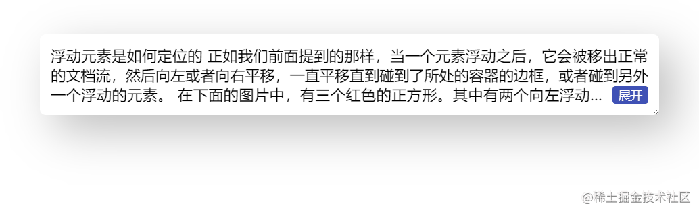
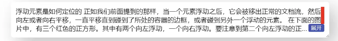

# css实现多行截断,展开收起效果



实现这一类布局和交互难点主要有以下几点
<br>
1位于多行文本右下角的“展开收起”按钮<br>
2“展开”和“收起”两种状态的切换<br>
3当文本不超过指定行数时，不显示“展开收起”按钮

## 1. 多行文本截断
```css
.text {
  display: -webkit-box;
  -webkit-line-clamp: 3;
  -webkit-box-orient: vertical;
  overflow: hidden;
}
```

##  2. 右下角环绕效果
提到 文本环绕效果，一般能想到 浮动 float，没错，千万不要以为浮动已经是过去式了，具体的场景还是很有用的。比如下面放一个按钮，然后设置浮动

```html
<div class="text">
  <button class="btn">展开</button>
  浮动元素是如何定位的
正如我们前面提到的那样，当一个元素浮动之后，它会被移出正常的文档流，然后向左或者向右平移，一直平移直到碰到了所处的容器的边框，或者碰到另外一个浮动的元素。
</div>
```
```css
.text::before{
  content: '';
  float: right;
  width: 10px;
  height: 50px;/*先随便设置一个高度*/
  background: red
}

.btn {
  float: right;
  clear: both;
  /*其他装饰样式*/
}
```
如下图样式,去掉背景色red就行


## 3. 动态高度
上面虽然完成了右下加环绕，但是高度是固定的，如何动态设置呢,动态高度也可以采用负的 margin 来实现（性能会比 calc 略好一点）

```css
.text::before{
   content: '';
  float: right;
  width: 0;
  height: calc(100% - 24px);
}
```
这里需要给 .text 包裹一层，然后设置 display: flex

```html
<div class="wrap">
  <div class="text">
    <button class="btn">展开</button>
    浮动元素是如何定位的
  正如我们前面提到的那样，当一个元素浮动之后，它会被移出正常的文档流，然后向左或者向右平移，一直平移直到碰到了所处的容器的边框，或者碰到另外一个浮动的元素。
  </div>
</div>
```
```css
.wrap{
  display: flex;
}
```

到这里，右下角环绕的效果就基本完成，省略号也是位于展开按钮之前的

```html
<div class="wrapper">
        <div class="text">
            <button class="btn">这是一个占位</button>
            浮动元素是如何定位的
正如我们前面提到的那样，当一个元素浮动之后，它会被移出正常的文档流，然后向左或者向右平移，一直平移直到碰到了所处的容器的边框，或者碰到另外一个浮动的元素。

在下面的图片中，有三个红色的正方形。其中有两个向左浮动，一个向右浮动。要注意到第二个向左浮动的正方形被放在第一个向左浮动的正方形的右边。如果还有更多的正方形这样浮动，它们会继续向右堆放，直到填满容器一整行，之后换行至下一行。
在前面的例子当中，浮动的元素的高度比它们所在的容器元素（是块元素）的高度小。然而如果块元素内的文本太短，不足以把块元素的大小撑到高度大于所有浮动元素的高度，我们可能会看到意想不到的效果。例如，如果上面图片中的文字只有"Lorem ipsum dolor sit amet,"，并且接下来是另外一个和"Floats Example"这个标题一样风格的标题元素，那么第二个标题元素会出现在红色的正方形之间。然而在大多数这种情况下，我们希望这个标题元素是靠左对齐的。为了实现这个效果，我们需要清除浮动。
        </div>
    </div>


<div class="wrapper">
        <div class="text" style="-webkit-line-clamp: 5;">
            <button class="btn">这是一个占位</button>
            浮动元素是如何定位的
正如我们前面提到的那样，当一个元素浮动之后，它会被移出正常的文档流，然后向左或者向右平移，一直平移直到碰到了所处的容器的边框，或者碰到另外一个浮动的元素。

在下面的图片中，有三个红色的正方形。其中有两个向左浮动，一个向右浮动。要注意到第二个向左浮动的正方形被放在第一个向左浮动的正方形的右边。如果还有更多的正方形这样浮动，它们会继续向右堆放，直到填满容器一整行，之后换行至下一行。
在前面的例子当中，浮动的元素的高度比它们所在的容器元素（是块元素）的高度小。然而如果块元素内的文本太短，不足以把块元素的大小撑到高度大于所有浮动元素的高度，我们可能会看到意想不到的效果。例如，如果上面图片中的文字只有"Lorem ipsum dolor sit amet,"，并且接下来是另外一个和"Floats Example"这个标题一样风格的标题元素，那么第二个标题元素会出现在红色的正方形之间。然而在大多数这种情况下，我们希望这个标题元素是靠左对齐的。为了实现这个效果，我们需要清除浮动。
          在前面的例子当中，浮动的元素的高度比它们所在的容器元素（是块元素）的高度小。然而如果块元素内的文本太短，不足以把块元素的大小撑到高度大于所有浮动元素的高度，我们可能会看到意想不到的效果。例如，如果上面图片中的文字只有"Lorem ipsum dolor sit amet,"，并且接下来是另外一个和"Floats Example"这个标题一样风格的标题元素，那么第二个标题元素会出现在红色的正方形之间。然而在大多数这种情况下，我们希望这个标题元素是靠左对齐的。为了实现这个效果，我们需要清除浮动。
        </div>
    </div>
.wrapper {
  display: flex;
  margin: 50px auto;
  width: 800px;
  overflow: hidden;
  border-radius: 8px;
  padding: 15px ;
  box-shadow: 20px 20px 60px #bebebe,
    -20px -20px 60px #ffffff;
}
.text {
  font-size: 20px;
  overflow: hidden;
  text-overflow: ellipsis;
  text-align: justify;
  /* display: flex; */
  display: -webkit-box;
  -webkit-line-clamp: 3;
  -webkit-box-orient: vertical;
  position: relative;
}
.text::before {
  content: '';
  height: calc(100% - 24px);
  float: right;
}
.btn{
  float: right;
  clear: both;
  margin-left: 10px;
  font-size: 16px;
  padding: 0 8px;
  background: #3F51B5;
  line-height: 24px;
  border-radius: 4px;
  color:  #fff;
  cursor: pointer;
  border:0;
  /* margin-top: -30px; */
}
button{
  float: right;
  clear: both;
  margin-left: 10px;
  /* margin-top: -30px; */
}

```

## 4.其他浏览器的兼容处理
display: -webkit-box！在safari有问题，设置该属性后，原本的文本好像变成了一整块，浮动元素也无法产生环绕效果，去掉之后浮动就正常了<br>
那么问题来了：没有 display: -webkit-box 怎么实现多行截断呢 ？
其实上面的努力已经实现了右下角环绕的效果，如果在知道行数的情况下设置一个最大高度，是不是也完成了多行截断呢？为了便于设置高度，可以添加一个行高 line-height，如果需要设置成 3 行，那高度就设置成line-height * 3

```css
.text {
  /*
  display: -webkit-box;
  -webkit-line-clamp: 3;
  -webkit-box-orient: vertical;
  */
  line-height: 1.5;
  max-height: 4.5em;
  overflow: hidden;
}
```

现在加上省略号吧，跟在展开按钮之前就可以了，可以用伪元素实现
```css 
.btn::before{
  content: '...';
  position: absolute;
  left: -10px;
  color: #333;
  transform: translateX(-100%)
}
```
这样，Safari 和 Firefox 的兼容布局基本上就完成了
```html
<div class="wrapper">
        <div class="text">
            <button class="btn">这是一个占位</button>
            浮动元素是如何定位的
正如我们前面提到的那样，当一个元素浮动之后，它会被移出正常的文档流，然后向左或者向右平移，一直平移直到碰到了所处的容器的边框，或者碰到另外一个浮动的元素。

在下面的图片中，有三个红色的正方形。其中有两个向左浮动，一个向右浮动。要注意到第二个向左浮动的正方形被放在第一个向左浮动的正方形的右边。如果还有更多的正方形这样浮动，它们会继续向右堆放，直到填满容器一整行，之后换行至下一行。
在前面的例子当中，浮动的元素的高度比它们所在的容器元素（是块元素）的高度小。然而如果块元素内的文本太短，不足以把块元素的大小撑到高度大于所有浮动元素的高度，我们可能会看到意想不到的效果。例如，如果上面图片中的文字只有"Lorem ipsum dolor sit amet,"，并且接下来是另外一个和"Floats Example"这个标题一样风格的标题元素，那么第二个标题元素会出现在红色的正方形之间。然而在大多数这种情况下，我们希望这个标题元素是靠左对齐的。为了实现这个效果，我们需要清除浮动。
        </div>
    </div>


<div class="wrapper">
        <div class="text" style="max-height: 7.5em;">
            <button class="btn">这是一个占位</button>
            浮动元素是如何定位的
正如我们前面提到的那样，当一个元素浮动之后，它会被移出正常的文档流，然后向左或者向右平移，一直平移直到碰到了所处的容器的边框，或者碰到另外一个浮动的元素。

在下面的图片中，有三个红色的正方形。其中有两个向左浮动，一个向右浮动。要注意到第二个向左浮动的正方形被放在第一个向左浮动的正方形的右边。如果还有更多的正方形这样浮动，它们会继续向右堆放，直到填满容器一整行，之后换行至下一行。
在前面的例子当中，浮动的元素的高度比它们所在的容器元素（是块元素）的高度小。然而如果块元素内的文本太短，不足以把块元素的大小撑到高度大于所有浮动元素的高度，我们可能会看到意想不到的效果。例如，如果上面图片中的文字只有"Lorem ipsum dolor sit amet,"，并且接下来是另外一个和"Floats Example"这个标题一样风格的标题元素，那么第二个标题元素会出现在红色的正方形之间。然而在大多数这种情况下，我们希望这个标题元素是靠左对齐的。为了实现这个效果，我们需要清除浮动。
          在前面的例子当中，浮动的元素的高度比它们所在的容器元素（是块元素）的高度小。然而如果块元素内的文本太短，不足以把块元素的大小撑到高度大于所有浮动元素的高度，我们可能会看到意想不到的效果。例如，如果上面图片中的文字只有"Lorem ipsum dolor sit amet,"，并且接下来是另外一个和"Floats Example"这个标题一样风格的标题元素，那么第二个标题元素会出现在红色的正方形之间。然而在大多数这种情况下，我们希望这个标题元素是靠左对齐的。为了实现这个效果，我们需要清除浮动。
        </div>
    </div>
    .wrapper {
  display: flex;
  margin: 50px auto;
  width: 800px;
  overflow: hidden;
  border-radius: 8px;
  padding: 15px ;
  box-shadow: 20px 20px 60px #bebebe,
    -20px -20px 60px #ffffff;
}
.text {
  font-size: 20px;
  overflow: hidden;
  text-overflow: ellipsis;
  text-align: justify;
  /* display: flex; */
/*   display: -webkit-box;
  -webkit-line-clamp: 3;
  -webkit-box-orient: vertical; */
  line-height: 1.5;
  max-height: 4.5em;
  position: relative;
}
.text::before {
  content: '';
  height: calc(100% - 26px);
  float: right;
}
.btn{
  position: relative;
  float: right;
  clear: both;
  margin-left: 20px;
  font-size: 16px;
  padding: 0 8px;
  background: #3F51B5;
  line-height: 24px;
  border-radius: 4px;
  color:  #fff;
  cursor: pointer;
  border:0;
  /* margin-top: -30px; */
}
.btn::before{
  content: '...';
  position: absolute;
  left: -5px;
  color: #333;
  transform: translateX(-100%)
}
```

## 之后的展开收起也可以用js实现也可以用css实现
css实现地址 <https://juejin.cn/post/6963904955262435336#heading-7> <br>
js实现大家可以自己尝试