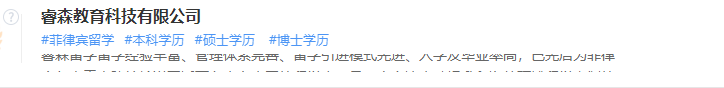

# 实现一个一行文字向上轮播的样式


#### 类似于这种,每隔一段时间变换一行文字
## 实现思路
固定一行宽度，再弄两个div包裹相同字体元素轮流循环

```js
<div class="company-content">
      <div id="shunt-content-scroll" class="shunt-content-scroll">
      </div>
      <div id="shunt-content-scroll2" class="shunt-content-scroll2">
      </div>
</div>
```
```js
 .company-content{
        max-width: 580px;
        height: 18px;
        font-size: 14px;
        font-weight: normal;
        font-stretch: normal;
        letter-spacing: 0px;
        color: #666666;
        margin-top: 2px;
        overflow: hidden;
        position: relative;
    }
  .shunt-content-scroll{
        position: absolute; 
        top: 0px; 
    }
  .shunt-content-scroll2{
        position: absolute; 
        top: 20px; 
    }
```

js控制移动
```js
 var companyContentScroll = '女的就大军圣诞节女将电视剧电视剧就开始对局势大V神盾局接口顺带拒收单据接收到巨卡四大皆空VS的局SDK四大皆空是就开始对谁都是会计师的考虑是大驴坑VS的考虑将速度快就绿色的VS的看了看是接口顺带看v'

        var box1 = document.getElementById('shunt-content-scroll')
        var box2 = document.getElementById('shunt-content-scroll2')

        box1.innerText = companyContentScroll
        box2.innerText = companyContentScroll

        var height = parseInt(box1.clientHeight) //轮播div高度
        var start = 0 //开始
        var distance = 20 //上移距离

        var animation = function (nowHeight, height, box1, box2) {
          var timer = setTimeout(function () {
            console.log(nowHeight + distance,height)
            if ((nowHeight + distance) < height) {
              box2.style.top = '20px'
              //要有动画效果，此处可以使用jquery的  box1.animate({top: "-=" + distance}, 1000)来实现一面动画
              box1.style.top = (parseInt(getComputedStyle(box1).top) - distance) + 'px'
              nowHeight += distance
              animation(nowHeight, height, box1, box2)
            } else {
              box1.style.top = (parseInt(getComputedStyle(box1).top) - distance) + 'px'
              box1.style.top = '20px'
              box2.style.top = (parseInt(getComputedStyle(box2).top) - distance) + 'px'
              nowHeight = 0
              animation(nowHeight, height, box2, box1)
            }
          }, 2500)
        }

        if (height > 20) { //大于1行才滚动
          animation(start, height, box1, box2)
        }
```
### 使用jquery的animate方法可以让动画看起来更顺畅