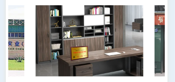

## 1实现效果


```html
<div class="swiper-container">
              <div class="swiper-wrapper" style="display: flex;align-items: center;">
                  <div class="swiper-slide">
                    
                    <!-- <div class="company-name">{{ companyName }}</div> -->
                  </div>
                  <div class="swiper-slide">
                    
                  </div>
                  <div class="swiper-slide">
                    
                  </div>
                  <div class="swiper-slide">
                    
                  </div>
                  <div class="swiper-slide">
                    
                  </div>
              </div>
        </div>
```

```js
 Lunbo() {
            var swiper = new Swiper('.swiper-container', {
                slidesPerView: 2,
                slidesOffsetBefore: 60, //前面距离
                spaceBetween: 180, //幻灯片之间距离
                loop: true,  //设置循环模式
                speed: 1000,
                // 设置自动播放功能，每隔3000ms（3秒）自动播放一次。disableOnInteraction: false表示当用户交互（如拖动）时不停止自动播放。
                autoplay: {
                  delay: 3000,
                  disableOnInteraction: false,
                },
                autoplayDisableOnInteraction: false,
                observer: true, //启用observer功能，当Swiper的DOM结构发生变化（如幻灯片增加或删除）时，Swiper会重新初始化
                observeParents: true,
                pagination: '.swiper-pagination', //分页器类名
                paginationClickable: true, //设置分页器是否可以点击
                mousewheelControl: true,
                debugger: true,
            });
        },
```

## 2实现效果


```html
 <swiper :autoplay="true" interval="3000" duration="500"
                :circular="true" class="swiper-company" display-multiple-items="1" next-margin="100rpx">
      <swiper-item class="swiper-company-items" v-for="item in 5" :key="item">
            <div class="swiper-company-item">
                
            </div>
      </swiper-item>
  </swiper>
```