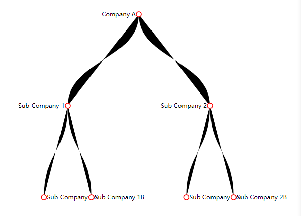
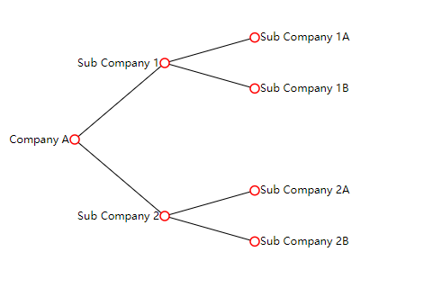

# 使用 d3js 完成层级布局

需求：实现下面数据的层级关系

```js
const data = {
  name: "Company A",
  children: [
    {
      name: "Sub Company 1",
      children: [{ name: "Sub Company 1A" }, { name: "Sub Company 1B" }],
    },
    {
      name: "Sub Company 2",
      children: [{ name: "Sub Company 2A" }, { name: "Sub Company 2B" }],
    },
  ],
};
```

## 使用第三方插件 d3js

树状布局，连线条纹状（path）

```html
<!DOCTYPE html>
<html lang="en">
  <head>
    <meta charset="UTF-8" />
    <meta name="viewport" content="width=device-width, initial-scale=1.0" />
    <title>Company Tree Chart</title>
    <script src="https://d3js.org/d3.v7.min.js"></script>
    <style>
      .node circle {
        fill: #fff;
        stroke: red;
        stroke-width: 1.5px;
      }

      .node text {
        font: 12px sans-serif;
      }
    </style>
  </head>
  <body>
    <svg width="600" height="400"></svg>
    <script>
      const data = {
        name: "Company A",
        children: [
          {
            name: "Sub Company 1",
            children: [{ name: "Sub Company 1A" }, { name: "Sub Company 1B" }],
          },
          {
            name: "Sub Company 2",
            children: [{ name: "Sub Company 2A" }, { name: "Sub Company 2B" }],
          },
        ],
      };

      const width = 600;
      const height = 400;

      const svg = d3
        .select("svg")
        .attr("width", width)
        .attr("height", height)
        .append("g")
        .attr("transform", "translate(20,20)");

      const tree = d3.tree().size([width - 40, height - 40]);

      const root = d3.hierarchy(data);
      tree(root);

      const link = svg
        .selectAll(".link")
        .data(root.links())
        .enter()
        .append("path")
        .attr("class", "link")
        .attr(
          "d",
          d3
            .linkVertical()
            .x((d) => d.x)
            .y((d) => d.y)
        );

      const node = svg
        .selectAll(".node")
        .data(root.descendants())
        .enter()
        .append("g")
        .attr("class", "node")
        .attr("transform", (d) => `translate(${d.x},${d.y})`);

      node.append("circle").attr("r", 5);

      node
        .append("text")
        .attr("dy", "0.31em")
        .attr("x", (d) => (d.children ? -6 : 6))
        .style("text-anchor", (d) => (d.children ? "end" : "start"))
        .text((d) => d.data.name);
    </script>
  </body>
</html>
```

## 效果



## 横状布局，连线横线状（line）

```html
<!DOCTYPE html>
<html lang="en">
  <head>
    <meta charset="UTF-8" />
    <meta name="viewport" content="width=device-width, initial-scale=1.0" />
    <title>Company Tree Chart</title>
    <script src="https://d3js.org/d3.v7.min.js"></script>
    <style>
      .node circle {
        fill: #fff;
        stroke: red;
        stroke-width: 1.5px;
      }

      .node text {
        font: 12px sans-serif;
      }
    </style>
  </head>
  <body>
    <svg width="600" height="400"></svg>
    <script>
      const data = {
        name: "Company A",
        children: [
          {
            name: "Sub Company 1",
            children: [{ name: "Sub Company 1A" }, { name: "Sub Company 1B" }],
          },
          {
            name: "Sub Company 2",
            children: [{ name: "Sub Company 2A" }, { name: "Sub Company 2B" }],
          },
        ],
      };

      const width = 600;
      const height = 400;

      const svg = d3
        .select("svg")
        .attr("width", width)
        .attr("height", height)
        .append("g")
        .attr("transform", "translate(80,10)"); // 调整g的位置

      const tree = d3.tree().size([height - 60, width - 400]); // 调整树的大小，以确保元素完全显示在 SVG 中

      const root = d3.hierarchy(data);
      tree(root);

      const link = svg
        .selectAll(".link")
        .data(root.links())
        .enter()
        .append("line")
        .attr("class", "link")
        .attr("x1", function (d) {
          return d.source.y;
        })
        .attr("y1", function (d) {
          return d.source.x;
        })
        .attr("x2", function (d) {
          return d.target.y;
        })
        .attr("y2", function (d) {
          return d.target.x;
        })
        .style("stroke", "black");

      const node = svg
        .selectAll(".node")
        .data(root.descendants())
        .enter()
        .append("g")
        .attr("class", "node")
        .attr("transform", (d) => `translate(${d.y},${d.x})`);

      node.append("circle").attr("r", 5);

      node
        .append("text")
        .attr("dy", "0.31em")
        .attr("x", (d) => (d.children ? -6 : 6))
        .style("text-anchor", (d) => (d.children ? "end" : "start"))
        .text((d) => d.data.name);
    </script>
  </body>
</html>
```

## 效果


