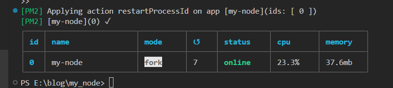

## 使用Express.js来构建Node.js
创建项目文件夹：选择一个合适的位置，在你的计算机上创建一个用于存储项目文件的文件夹。
### 1初始化项目：在项目文件夹中打开命令行终端，并执行以下命令来初始化项目：
```js
cd 项目文件夹路径
npm init
```
这将引导你完成一个交互式的过程，用于设置项目的基本信息，如项目名称、版本、描述等。按照提示进行设置，你可以在最后生成一个package.json文件，它将记录你的项目配置和依赖项。
### 2安装Express：在命令行终端中执行以下命令来安装Express：
```js
npm install express
```
这将从npm仓库中下载并安装Express模块。
### 3创建入口文件：在项目文件夹中创建一个名为index.js（或其他你喜欢的名称）的文件，作为你的项目的入口文件。
编写代码：打开index.js文件，并使用以下代码来编写一个简单的Express应用程序：
```js
const express = require('express');
const app = express();

// 定义路由
app.get('/', (req, res) => {
  res.send('Hello, Express!');
});

// 启动服务器
app.listen(3000, () => {
  console.log('Server is running on port 3000');
});
```
在这个例子中，我们引入了express模块，然后创建了一个Express应用程序。我们定义了一个GET路由，当用户访问根路径时，服务器将返回一个"Hello, Express!"的响应。最后，我们使用app.listen方法来启动服务器并监听3000端口。
运行项目：在命令行终端中，使用以下命令来运行你的Express项目：
```js
node index.js
```
这将启动Express服务器，并开始监听3000端口。你可以在浏览器中访问http://localhost:3000，应该能看到"Hello, Express!"的输出。

## 实现Node.js项目的热更新
### nodemon
nodemon是一个开发工具，可以在检测到文件变化时自动重新启动Node.js应用程序。你可以使用npm全局安装nodemon，并在命令行中运行你的应用程序，例如：nodemon index.js。nodemon将监视文件的更改，并在保存文件后自动重新启动应用程序。

#### 使用nodemon
1安装nodemon：首先，你需要全局安装nodemon。在命令行中运行以下命令：
```js
npm install -g nodemon
```
2运行项目：使用nodemon来运行你的Node.js应用程序。假设你的入口文件是index.js，你可以使用以下命令来启动项目：
```js
nodemon index.js
```
nodemon会监视项目目录中的文件变化，并在检测到更改时自动重启应用程序。

### pm2
pm2是一个进程管理器，它可以帮助你管理Node.js应用程序的生命周期。它支持热更新功能，可以在代码更改后自动重新启动应用程序。你可以使用npm全局安装pm2，并在命令行中运行你的应用程序，例如：pm2 start index.js。pm2将监视文件的更改，并在保存文件后自动重新启动应用程序。
#### 使用pm2
1安装pm2：全局安装pm2，运行以下命令：
```js
npm install -g pm2
```
2运行项目：使用pm2来启动你的Node.js应用程序。同样，假设你的入口文件是index.js，你可以使用以下命令来启动项目：
```js
pm2 start index.js
```
pm2会管理你的应用程序，并在检测到文件更改时自动重启它。  

3配置热更新：要让pm2支持热更新，你需要使用pm2的watch和restart功能。在启动应用程序时，添加--watch和--restart-delay选项：
```js
pm2 start index.js --watch --restart-delay=1000
```
--watch选项告诉pm2监视文件变化，--restart-delay选项设置重启延迟时间（毫秒）。  

4保存配置：你可以将pm2的配置保存到一个文件中，以便于管理和重用。创建一个名为ecosystem.config.js的文件，并添加以下内容：
```js
module.exports = {
  apps: [
    {
      name: 'my-app',
      script: 'index.js',
      watch: true,
      restart_delay: 1000,
    },
  ],
};
```
然后，使用以下命令启动应用程序：
```js
pm2 start ecosystem.config.js
```
5更新代码：当你修改了项目中的文件后，pm2会自动检测到变化并重启应用程序。

#### 区别
nodemon主要用于开发环境，而pm2则更适用于生产环境，它提供了更多的进程管理功能，如负载均衡、日志管理等。
如图


## 连接mysql数据库
1安装数据库驱动：根据你使用的数据库类型，选择合适的数据库驱动，如mysql、mongodb等，并使用npm安装它。例如，如果你使用MySQL数据库，可以运行以下命令安装mysql驱动：
```js
npm install mysql2
```
2引入数据库驱动：在你的代码中引入适当的数据库驱动。例如，如果你使用mysql驱动，可以在代码中添加以下行：  
3创建数据库连接：根据数据库的连接配置，创建一个数据库连接。例如，对于MySQL数据库，你可以使用以下代码创建一个数据库连接：  
4编写查询代码：使用数据库连接对象执行你的查询代码。以下是一个简单的示例，查询一个名为users的表中的所有数据：
```js
const mysql = require('mysql2');
const connection = mysql.createConnection({
  host: 'localhost',
  user: 'root',
  password: 'root',
  database: 'db',
});


app.get('/user', (req, res) => {
  connection.query('select * from user', (err, results) => {
    if (err) {
      console.error(err);
      res.status(500).send('Error retrieving data from database');
    } else {
      res.json(results);
    }
  });
});
```
