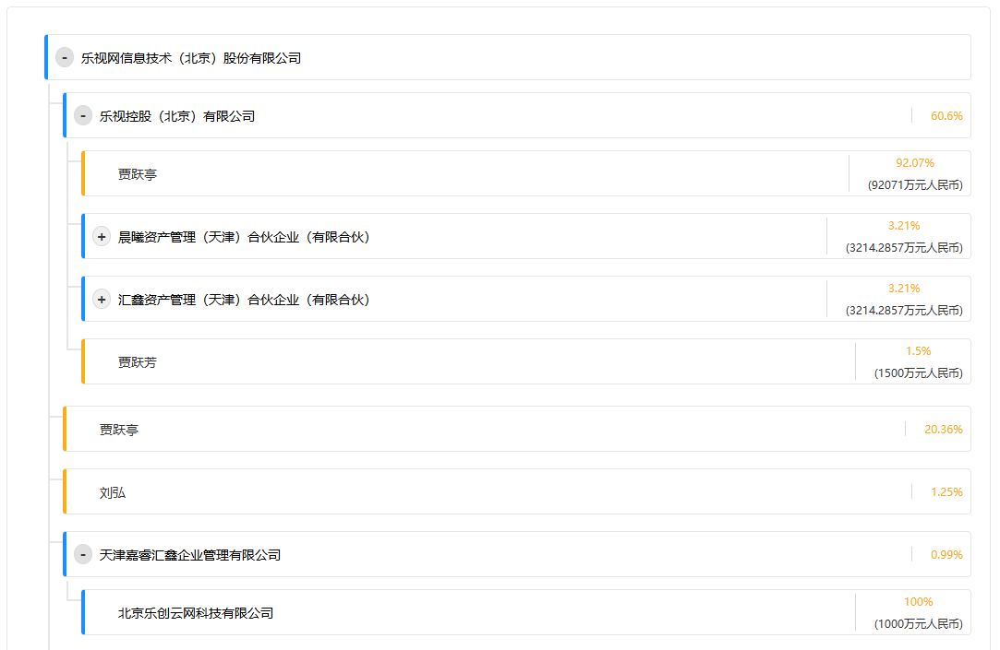

# react实现一个公司结构树
### 如图

第一级和第二级默认打开，第三级默认关闭
### 数据结构
```js
"ownership_structure": {
"stock_name": "乐视网信息技术（北京）股份有限公司",
"children": [
{
"stock_name": "乐视控股（北京）有限公司",
"stock_capital": "",
"type": "largest",
"type_tmp": "enterprise",
"digest": "962c3f0b53c62c2751119f54a8702b9e",
"capital_percent": "60.6%",
"children": [
{
"stock_name": "贾跃亭",
"stock_capital": "92071万元人民币",
"type": "largest",
"type_tmp": "natural",
"digest": null,
"capital_percent": "92.07%"
},
{
"stock_name": "晨曦资产管理（天津）合伙企业（有限合伙）",
"stock_capital": "3214.2857万元人民币",
"type": "enterprise",
"type_tmp": "enterprise",
"digest": "844e03dc9fe5c7404341c11d3d2ad024",
"capital_percent": "3.21%",
"children": [
{
"stock_name": "贾跃芳",
"stock_capital": "4000万元人民币",
"type": "largest",
"type_tmp": "natural",
"digest": null,
"capital_percent": "80%"
},
{
"stock_name": "乐视互联科技发展（北京）有限公司",
"stock_capital": "1000万元人民币",
"type": "enterprise",
"type_tmp": "enterprise",
"digest": "a3aa6476a985cdb8dc34ec91c90704d9",
"capital_percent": "20%",
"children": [
{
"stock_name": "刘丰选",
"stock_capital": "5万元人民币",
"type": "natural",
"type_tmp": "natural",
"digest": null,
"capital_percent": ""
},
{
"stock_name": "刘文选",
"stock_capital": "45万元人民币",
"type": "natural",
"type_tmp": "natural",
"digest": null,
"capital_percent": ""
}
]
}
]
},
{
"stock_name": "汇鑫资产管理（天津）合伙企业（有限合伙）",
"stock_capital": "3214.2857万元人民币",
"type": "enterprise",
"type_tmp": "enterprise",
"digest": "da72e87ebfbd2e201b8f4aca9b7cac50",
"capital_percent": "3.21%",
"children": [
{
"stock_name": "乐视互联科技发展（北京）有限公司",
"stock_capital": "9500万元人民币",
"type": "largest",
"type_tmp": "enterprise",
"digest": "a3aa6476a985cdb8dc34ec91c90704d9",
"capital_percent": "95%",
"children": [
{
"stock_name": "刘丰选",
"stock_capital": "5万元人民币",
"type": "natural",
"type_tmp": "natural",
"digest": null,
"capital_percent": ""
},
{
"stock_name": "刘文选",
"stock_capital": "45万元人民币",
"type": "natural",
"type_tmp": "natural",
"digest": null,
"capital_percent": ""
}
]
},
{
"stock_name": "贾跃芳",
"stock_capital": "500万元人民币",
"type": "natural",
"type_tmp": "natural",
"digest": null,
"capital_percent": "5%"
}
]
},
{
"stock_name": "贾跃芳",
"stock_capital": "1500万元人民币",
"type": "natural",
"type_tmp": "natural",
"digest": null,
"capital_percent": "1.5%"
}
]
},
{
"stock_name": "贾跃亭",
"stock_capital": "",
"type": "natural",
"type_tmp": "natural",
"digest": null,
"capital_percent": "20.36%"
},
{
"stock_name": "刘弘",
"stock_capital": "",
"type": "natural",
"type_tmp": "natural",
"digest": null,
"capital_percent": "1.25%"
},
{
"stock_name": "天津嘉睿汇鑫企业管理有限公司",
"stock_capital": "",
"type": "enterprise",
"type_tmp": "enterprise",
"digest": "26b3eb3ba6bf10b5f83549097e053b6f",
"capital_percent": "0.99%",
"children": [
{
"stock_name": "北京乐创云网科技有限公司",
"stock_capital": "1000万元人民币",
"type": "largest",
"type_tmp": "enterprise",
"digest": null,
"capital_percent": "100%"
}
]
},
{
"stock_name": "国泰君安证券股份有限公司",
"stock_capital": "",
"type": "enterprise",
"type_tmp": "enterprise",
"digest": "19471c08389e7fad135a1118abc96eb2",
"capital_percent": "0.68%",
"children": [
{
"stock_name": "上海国有资产经营有限公司",
"stock_capital": "",
"type": "largest",
"type_tmp": "enterprise",
"digest": null,
"capital_percent": "21.34%"
},
{
"stock_name": "香港中央结算（代理人）有限公司",
"stock_capital": "",
"type": "enterprise",
"type_tmp": "enterprise",
"digest": null,
"capital_percent": "15.63%"
},
{
"stock_name": "上海国际集团有限公司",
"stock_capital": "",
"type": "enterprise",
"type_tmp": "enterprise",
"digest": "9a7ab74773bafddbd243f066cafffb3a",
"capital_percent": "7.66%",
"children": [
{
"stock_name": "上海市国有资产监督管理委员会",
"stock_capital": "1055884万元人民币",
"type": "largest",
"type_tmp": "enterprise",
"digest": null,
"capital_percent": "100%"
}
]
},
{
"stock_name": "深圳市投资控股有限公司",
"stock_capital": "",
"type": "enterprise",
"type_tmp": "enterprise",
"digest": null,
"capital_percent": "6.84%"
},
{
"stock_name": "中国证券金融股份有限公司",
"stock_capital": "",
"type": "enterprise",
"type_tmp": "enterprise",
"digest": null,
"capital_percent": "2.93%"
},
{
"stock_name": "上海城投（集团）有限公司",
"stock_capital": "",
"type": "enterprise",
"type_tmp": "enterprise",
"digest": null,
"capital_percent": "2.77%"
},
{
"stock_name": "香港中央结算有限公司",
"stock_capital": "",
"type": "enterprise",
"type_tmp": "enterprise",
"digest": null,
"capital_percent": "1.89%"
},
{
"stock_name": "深圳能源集团股份有限公司",
"stock_capital": "",
"type": "enterprise",
"type_tmp": "enterprise",
"digest": null,
"capital_percent": "1.73%"
},
{
"stock_name": "中国建设银行股份有限公司-国泰中证全指证券公司交易型开放式指数证券投资基金",
"stock_capital": "",
"type": "enterprise",
"type_tmp": "enterprise",
"digest": null,
"capital_percent": "1.07%"
},
{
"stock_name": "中国核工业集团资本控股有限公司",
"stock_capital": "",
"type": "enterprise",
"type_tmp": "enterprise",
"digest": null,
"capital_percent": "0.86%"
}
]
},
{
"stock_name": "毕绍波",
"stock_capital": "",
"type": "natural",
"type_tmp": "natural",
"digest": null,
"capital_percent": "0.61%"
},
{
"stock_name": "大成基金-农业银行-大成中证金融资产管理计划",
"stock_capital": "",
"type": "enterprise",
"type_tmp": "enterprise",
"digest": null,
"capital_percent": "0.47%"
},
{
"stock_name": "徐含冰",
"stock_capital": "",
"type": "natural",
"type_tmp": "natural",
"digest": null,
"capital_percent": "0.39%"
},
{
"stock_name": "广发基金-农业银行-广发中证金融资产管理计划",
"stock_capital": "",
"type": "enterprise",
"type_tmp": "enterprise",
"digest": null,
"capital_percent": "0.38%"
},
{
"stock_name": "中欧基金-农业银行-中欧中证金融资产管理计划",
"stock_capital": "",
"type": "enterprise",
"type_tmp": "enterprise",
"digest": null,
"capital_percent": "0.34%"
},
{
"stock_name": "贾跃民",
"stock_capital": "",
"type": "natural",
"type_tmp": "natural",
"digest": null,
"capital_percent": "0.3%"
},
{
"stock_name": "崔的",
"stock_capital": "",
"type": "natural",
"type_tmp": "natural",
"digest": null,
"capital_percent": "0.27%"
},
{
"stock_name": "张春雨",
"stock_capital": "",
"type": "natural",
"type_tmp": "natural",
"digest": null,
"capital_percent": "0.27%"
},
{
"stock_name": "王汉卿",
"stock_capital": "",
"type": "natural",
"type_tmp": "natural",
"digest": null,
"capital_percent": "0.26%"
},
{
"stock_name": "陈伟民",
"stock_capital": "",
"type": "natural",
"type_tmp": "natural",
"digest": null,
"capital_percent": "0.26%"
}
],
"type": "enterprise"
},
```
代码实现
```jsx
import React, { useState, useRef, useEffect } from "react";
import "./ShareholdingStructure.scss";

const ShareholdingStructure = ({ data }) => {
  const containerRef = useRef(null);
  const [expandedNodes, setExpandedNodes] = useState(() => {
    const initialExpanded = new Set();
    
    const expandFirstTwoLevels = (node, level = 0) => {
      if (level < 2 && node.stock_name) {
        initialExpanded.add(node.stock_name);
      }
      if (node.children) {
        node.children.forEach(child => expandFirstTwoLevels(child, level + 1));
      }
    };
    
    expandFirstTwoLevels(data);
    return initialExpanded;
  });

  const toggleNode = (nodeName) => {
    setExpandedNodes(prev => {
      const newSet = new Set(prev);
      if (newSet.has(nodeName)) {
        newSet.delete(nodeName);
      } else {
        newSet.add(nodeName);
      }
      return newSet;
    });
  };

  const renderNode = (node, level = 0) => {
    const hasChildren = node.children && node.children.length > 0;
    const showExpandIcon = hasChildren;
    const isCompany = node.type === 'enterprise' || node.type_tmp === 'enterprise';
    const isExpanded = expandedNodes.has(node.stock_name);

    return (
      <li key={node.stock_name}>
        <div 
          className={`${isCompany ? "company-bar" : "person-bar"} ${hasChildren ? 'has-children' : ''}`}
          onClick={() => hasChildren && toggleNode(node.stock_name)}
        >
          <div className="left-content">
            <div className="icon-wrapper">
              {showExpandIcon && (
                <span className={`expand-icon ${isExpanded ? 'expanded' : ''}`}>
                  {isExpanded ? "-" : "+"}
                </span>
              )}
            </div>
            <span className="name-wrapper">
              <span className={isCompany ? "company-name" : "person-name"}>
                {node.stock_name}
              </span>
            </span>
          </div>
          <div className="right-content">
            {node.capital_percent && (
              <span className="percentage">{node.capital_percent}</span>
            )}
            {node.stock_capital && (
              <span className="amount">({node.stock_capital})</span>
            )}
          </div>
        </div>
        {hasChildren && (
          <ul className={`children ${isExpanded ? 'expanded' : ''}`}>
            {node.children.map((child) => renderNode(child, level + 1))}
          </ul>
        )}
      </li>
    );
  };

  return (
    <div className="shareholding-structure" ref={containerRef}>
      <ul>{data && renderNode(data)}</ul>
    </div>
  );
};

export default ShareholdingStructure;
```
```scss
.shareholding-structure {
  padding: 20px;
  overflow-y: auto;
  background: #fff;
  border-radius: 5px;
  border: 1px solid #e6e6e6;

  ul {
    list-style: none;
    padding-left: 20px;
    margin: 0;
  }

  .company-bar, .person-bar {
    display: flex;
    justify-content: space-between;
    align-items: center;
    padding: 8px;
    margin: 4px 0;
    border-radius: 4px;
    cursor: pointer;

    &.has-children {
      cursor: pointer;
      
      &:hover {
        background-color: rgba(0, 0, 0, 0.05);
      }
    }
  }

  .left-content {
    display: flex;
    align-items: center;
    gap: 8px;
  }

  .icon-wrapper {
    width: 20px;
    display: flex;
    align-items: center;
    justify-content: center;
  }

  .expand-icon {
    display: inline-flex;
    align-items: center;
    justify-content: center;
    width: 20px;
    height: 20px;
    border-radius: 50%;
    background-color: #f0f0f0;
    font-weight: bold;
    transition: transform 0.2s ease;
    
    &.expanded {
      background-color: #e0e0e0;
    }
  }

  .children {
    max-height: 0;
    overflow: hidden;
    transition: max-height 0.3s ease-out;
    
    &.expanded {
      max-height: 1000px; // 设置一个足够大的值
    }
  }

  .company-name {
    // color: #1890ff;
  }

  .person-name {
    color: #333;
  }

  .right-content {
    display: flex;
    gap: 8px;
    color: #666;
  }
}
```