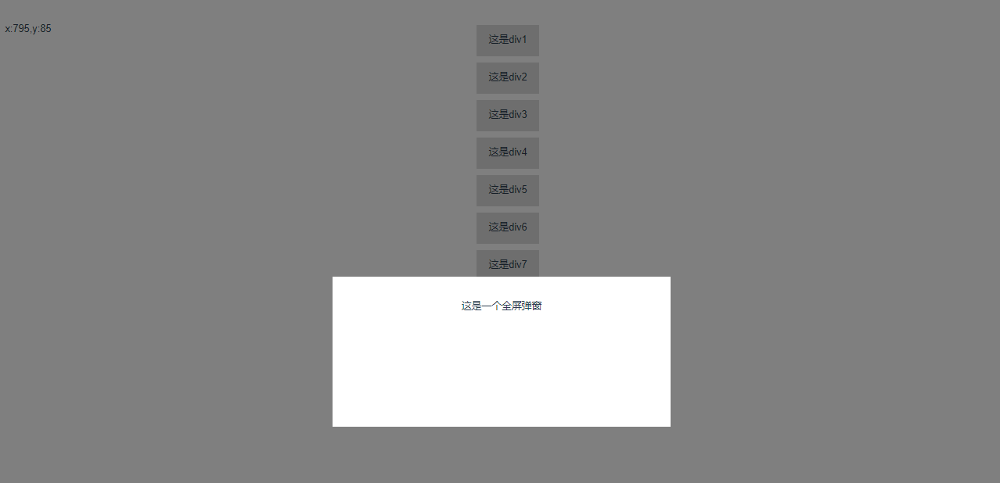
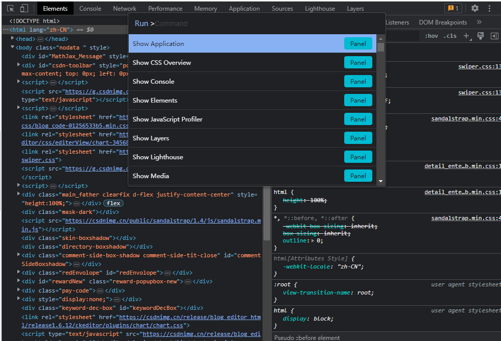
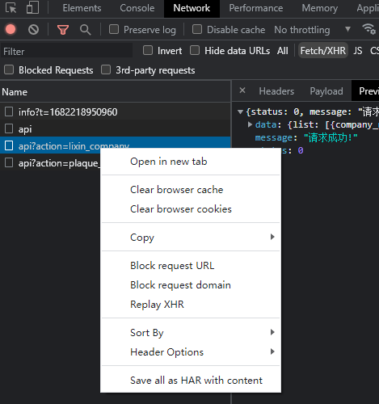
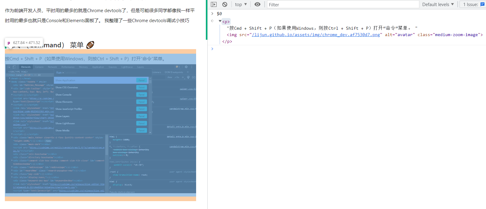
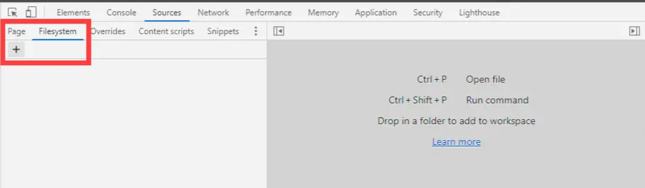
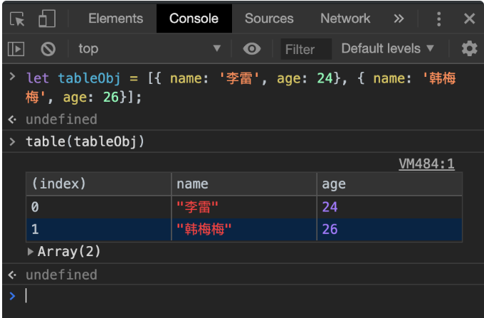
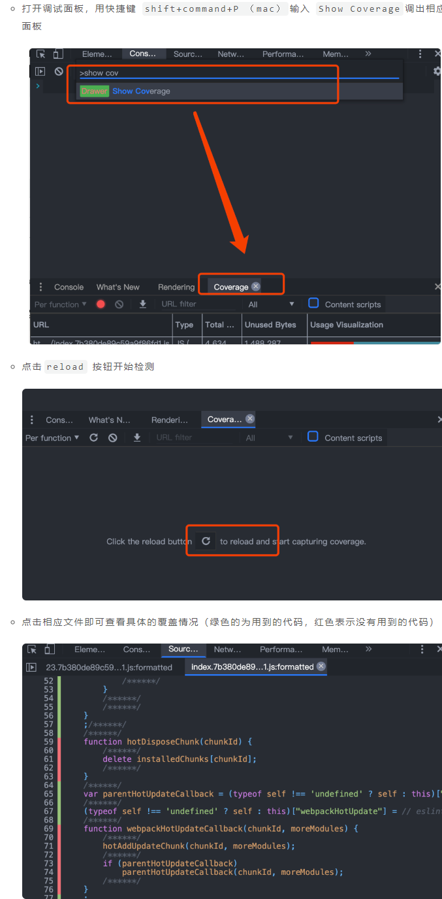

<!-- vscode-markdown-toc -->
* 1. [近期工作中遇到一个鼠标悬浮弹框问题如下](#)
* 2. [解决方法：](#-1)
	* 2.1. [1将绑定事件元素层级设置在悬浮层之上，此时元素比较明显可以再加个透明度让它看起来像是在遮罩层下面](#-1)
	* 2.2. [2不再用鼠标移出事件，监听鼠标x,y坐标和当前元素对比，出界了就关闭遮罩层](#xy)
		* 2.2.1. [1.获取坐标的组件](#-1)
		* 2.2.2. [2.页面](#-1)
* 3. [命令（Command） 菜单 🏈](#Command)
* 4. [截图DOM元素 🏉](#DOM)
	* 4.1. [1截取整个页面 Capture full size Screenshot,并不只是页面可视区域，而是包含滚动条在内的所有页面内容](#CapturefullsizeScreenshot)
	* 4.2. [2截取某个node节点 Capture node screenshot](#nodeCapturenodescreenshot)
* 5. [重新发起xhr请求 🚀](#xhr)
* 6. [编辑页面上的任何文本 ✍](#-1)
* 7. [使用$0快速访问选中的元素](#0)
* 8. [ 使用DevTools作为代码编辑器](#DevTools)
* 9. [动画检查 🎏](#-1)
* 10. [递增/递减 CSS 属性值 🃏](#CSS)
* 11. [table 🦐](#table)
* 12. [CSS/JS 覆盖率 ✅](#CSSJS)


##  1. <a name=''></a>近期工作中遇到一个鼠标悬浮弹框问题如下

此时有个坑就是如果直接设置移入移出事件，那么在弹框和遮罩出来的时候，就直接执行移除事件了
##  2. <a name='-1'></a>解决方法：
###  2.1. <a name='-1'></a>1将绑定事件元素层级设置在悬浮层之上，此时元素比较明显可以再加个透明度让它看起来像是在遮罩层下面
###  2.2. <a name='xy'></a>2不再用鼠标移出事件，监听鼠标x,y坐标和当前元素对比，出界了就关闭遮罩层
####  2.2.1. <a name='-1'></a>1.获取坐标的组件
````js
import { ref, onMounted, onUnmounted } from 'vue'

export default function useMousePosition() {
  const x = ref(0)
  const y = ref(0)

  const updateMousePosition = (event) => {
    x.value = event.pageX
    y.value = event.pageY
  }

  onMounted(() => {
    window.addEventListener('mousemove', updateMousePosition)
  })

  onUnmounted(() => {
    window.removeEventListener('mousemove', updateMousePosition)
  })

  return {
    x,
    y
  }
}
````

####  2.2.2. <a name='-1'></a>2.页面
````js
  setup(){
    const { x, y } = useMousePosition()//鼠标位置

    const overlay = ref(null);//遮罩层dom

    const showOverlay = function(e,item){//悬浮事件
      if (overlay.value) {
        show()
        watchXY(e,item)
      } else {
        console.log('DOM未被挂载');
      }
    }
    //关闭弹窗
    const close = function(){
      overlay.value.style.display = 'none'
    }
    //打开弹出
    const show = function(){
      overlay.value.style.display = 'block'
    }
    //监听坐标
    const watchXY = function(e,item){
      console.log(item)
      // const sx = e.target.offsetLeft
      // const sy = e.target.offsetTop
      const sx = e.target.getBoundingClientRect().left
      const sy = e.target.getBoundingClientRect().top
      let sx2 = sx+100
      let sy2 = sy+50
      // console.log(sx,sx2,sy,sy2)
      watch(() => [x.value, y.value],([newX,newY]) => {
          if((newX>sx&&newX<sx2)&&(newY>sy&&newY<sy2)){
            show()
          }else{
            if(overlay.value.style.display==='block'){
              close()
            }
          }
        })
    }
    return {
      x,
      y,
      showOverlay,
      overlay,
      close
    }
  }
````

# Chrome DevTools中的这些骚操作，你都知道吗
作为前端开发人员，平时用的最多的就是Chrome devtools了，但是可能很多同学都像我一样平时用的最多也就只是Console和Elements面板了。
我整理了一些Chrome devtools调试小技巧

##  3. <a name='Command'></a>命令（Command） 菜单 🏈
按Cmd + Shift + P（如果使用Windows，则按Ctrl + Shift + P）打开“命令”菜单。


##  4. <a name='DOM'></a>截图DOM元素 🏉
###  4.1. <a name='CapturefullsizeScreenshot'></a>1截取整个页面 Capture full size Screenshot,并不只是页面可视区域，而是包含滚动条在内的所有页面内容
###  4.2. <a name='nodeCapturenodescreenshot'></a>2截取某个node节点 Capture node screenshot

##  5. <a name='xhr'></a>重新发起xhr请求 🚀
在平时和后端联调时，我们用的最多的可能就是Network面板了。但是每次想重新查看一个请求，我们往往都是通过刷新页面、点击按钮等方式去触发xhr请求，这种方式有时显得会比较麻烦，我们可以通过google提供的Replay XHR的方式去发起一条新的请求，这样对于我们开发效率的提升是有所帮助的。



##  6. <a name='-1'></a>编辑页面上的任何文本 ✍
在控制台输入document.body.contentEditable="true"或者document.designMode = 'on'就可以实现对网页的编辑了。

##  7. <a name='0'></a>使用$0快速访问选中的元素


##  8. <a name='DevTools'></a> 使用DevTools作为代码编辑器


##  9. <a name='-1'></a>动画检查 🎏
DevTools 中有一个动画面板，默认情况下它是关闭的，很多人可能不太清楚这个功能。它可以让你控制和操纵 CSS 动画，并且可视化这些动画是如何工作的。

要打开该面板，可以在 DevTools 右上角菜单 → More tools 中打开 Animations

##  10. <a name='CSS'></a>递增/递减 CSS 属性值 🃏
作为前端开发，平时少不了通过Elements面板去查找元素以及它的css样式。有时调整像素px会比较麻烦一点，这时就可以使用快捷键去帮你完成：
````js
* 增量0.1
  * Mac：Option +向上和Option +向下
  * Windows：Alt +向上和Alt +向下
* 增量1
  * Mac：向上+向下
  * Windows：向上+向下
* 增量10
  * Mac：⇧+向上和⇧+向下
  * Windows：⇧+向上和⇧+向下
* 递增100
  * Mac：⌘+向上和⌘+向下
  * Windows：Ctrl +向上和Ctrl +向下
````
##  11. <a name='table'></a>table 🦐
Devtools提供的用于将对象数组记录为表格的API:

类似的还有copy(),save()等等

##  12. <a name='CSSJS'></a>CSS/JS 覆盖率 ✅
Chrome DevTools 中的Coverage功能可以帮助我们查看代码的覆盖率。
打开方式
打开调试面板，用快捷键 shift+command+P （mac）输入 Show Coverage调出相应面板
