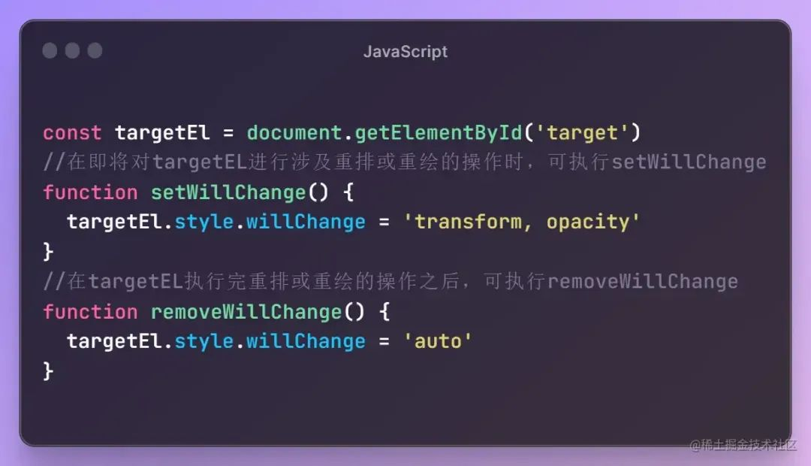

# CSS的will-change，为什么有时候能优化几十倍的性能？

前言
will-change 一个既陌生又熟悉的属性，以前在使用这个属性的时候，单纯是因为要做性能优化，加上will-change会使得动画变得流畅一些，但是实际上到底是什么原因导致加上will-change就能使得动画流畅，它有什么弊端？

## 看看以下代码
```js
html
复制代码
<template>
  <div class="list">
    <div class="item" v-for="i,k in lists" :key="k">
      ...
    </div>
  </div>
</template>

<style>
.item {
  will-change: transform;
}
</style>
```
给一个循环的元素加入了will-cahnge，这意味着网页上会有大量的元素加入了will-change，并且长留存

<strong>
在现代网页设计中，性能优化成为了一个重要的议题。一种关键的优化工具是CSS属性will-change，它可以告诉浏览器元素将要发生的变化，从而提前分配资源并优化渲染。本文将深入探讨will-change的使用和原理，以帮助开发者充分发挥其潜力，提升网页性能。
</strong>

## 一、什么是will-change？
will-change是一个CSS属性，它可以告诉浏览器某个元素将要发生的变化。通过明确指定这些变化，浏览器可以事先分配和优化相应的资源，从而提升渲染的性能。

## 二、will-change的使用方法
要使用will-change，只需将它应用于你要进行性能优化的元素上。
```js
.element {
  will-change: transform;
}
```
在上述示例中，我们告诉浏览器，该元素即将发生变换（transform），以便浏览器在渲染时提前分配所需的资源。

值得注意的是，因为will-change是为了性能优化而设计的，滥用它可能会带来负面影响。只在需要优化的元素上使用will-change，避免对所有元素都进行指定。

## 三、will-change的原理
要理解will-change的原理，我们需要了解浏览器渲染流程的基本概念。

### 1. 渲染流程简介
浏览器在渲染网页时，会经历一系列的步骤，如样式计算、布局、绘制和合成。为了提高性能，浏览器会尽量避免进行不必要的计算和操作。

### 2. will-change的作用
will-change的作用就是告诉浏览器某个元素将要发生的变化，从而使浏览器在渲染过程中提前分配和优化相应的资源。

例如，当我们设置了will-change: transform时，浏览器会为该元素创建一个独立的图层，将这个图层标记为“即将变换”。这样，在进行布局和绘制时，浏览器就可以更高效地处理这个元素，而无需重新计算整个渲染树。

### 3. will-change的优化效果
使用will-change可以带来以下优化效果：

减少渲染阻塞：浏览器可以提前分配和优化资源，减少渲染阻塞时间，提高页面的响应速度。
减少重绘和重排：浏览器可以更好地管理渲染过程，避免不必要的重绘和重排，从而提高渲染性能。
硬件加速：某些浏览器对will-change属性会进行硬件加速，进一步提升性能。

### 4. will-change使用的时机
在很多关于will-change的描述，都能够看到类似下面的一段话

在实际更改的元素上将 will-change 设置为您将实际更改的属性。并在他们停止时将其删除。- Tab Atkins Jr.（规范编辑者）
至于为什么？大部分的描述都是因为will-change会消耗浏览器GPU资源
当元素有 will-change 时，将元素提升到它们自己的“GPU 层”的浏览器。但有太多元素声明时，浏览器将忽略声明，以避免耗尽 GPU 内存

所以对于will-change的使用应该控制时机


在适当的时机移除will-change就是减少浏览器的复合层，避免过度使用will-change带来性能问题

### 四、iphone上使用will-change会导致图片模糊、文字模糊问题
在iphone上可以看到如果给元素加上will-change，可能出现模糊现象，分析一下问题

加入will-change，元素会提升到复合层，提升到复合层后，浏览器做了什么事？
安卓不会而iphone会，iphone上使用的是safari浏览器
解：

will-change加入后，元素提升到复合层，浏览器其实会进行光栅化,关于光栅化的内容可以查看这篇文章 [zhuanlan.zhihu.com/p/450540827](https://zhuanlan.zhihu.com/p/450540827)[1]
至于为什么safari浏览器在元素提升到复合层后，进行光栅化会导致模糊问题<br>
<strong>
在2016年之前，不止safari，谷歌浏览器也是存在模糊的问题，原因是提升复合层后，光栅化的时候，设备比例的变化，导致绘制 图像 的过程变模糊，谷歌是在2016年解决的这个问题，所以现在看来我们会在iphone上发现模糊问题，在安卓机上并不会
iphone上模糊的问题，可以通过在执行完重排重绘后在适当的时机移除will-change（让元素回到原来的页面层，不在单独一个复合层）就可以解决
</strong>

### 五、什么操作会将元素提升到复合层
在CSS中，以下属性可以将元素提升到复合层:

<span style="color:#63b1e4;">will-change</span> 属性：通过使用 will-change 属性，告诉浏览器该元素即将发生某种变化，浏览器可以提前将其提升到复合层以进行优化。<br>
<span style="color:#63b1e4;">transform</span> 属性：当使用 3D 或 2D 变换时，浏览器会自动将 transform 属性应用的元素提升到复合层。常见的变换函数translate(), rotate(), scale() 等。<br>
<span style="color:#63b1e4;">backface-visibility</span> 属性：当使用 backface-visibility: hidden 来隐藏元素的背面时，浏览器会将该元素提升到复合层。<br>
需要注意的是，将元素提升到复合层也会增加内存的占用和渲染的复杂性，因此不应滥用。只有当元素需要频繁改变或有复杂的动画效果时，才建议将其提升到复合层。

### 六、测试

测试代码
```js
<!DOCTYPE html>
<html>
<head>
  <title>will-change Performance Test</title>
  <style>
    .element {
      width: 100px;
      height: 100px;
      background-color: red;
      will-change: transform;
    }
  </style>
</head>

<body>
  <div class="element"></div>

  <script>
    // 在页面加载完成后，获取元素并进行动画操作
    window.addEventListener('load', function() {
      var element = document.querySelector('.element');
      
      function animate() {
        element.style.transform = 'translateX(200px)';
        element.style.opacity = '0.5';
        
        requestAnimationFrame(function() {
          element.style.transform = '';
          element.style.opacity = '';
          
          requestAnimationFrame(animate);
        });
      }
      
      animate();
    });
  </script>

</body>

</html>
```

### 七、结果分析
无will-change和有will-change

