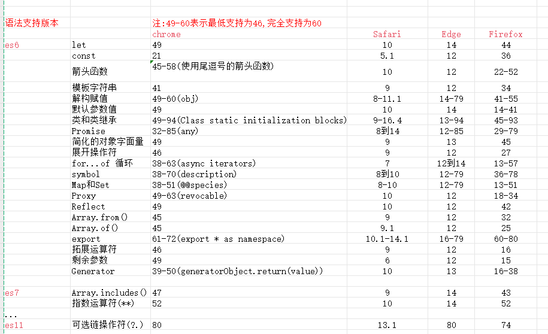

# 开发问题

## 浏览器兼容问题



Chrome：51 版起便可以支持 97% 的 ES6 新特性。
Firefox：53 版起便可以支持 97% 的 ES6 新特性。
Safari：10 版起便可以支持 99% 的 ES6 新特性。
IE：Edge 15可以支持 96% 的 ES6 新特性。
Edge 14 可以支持 93% 的 ES6 新特性。（IE7~11 基本不支持 ES6）
QQ 浏览器版本 11.9 应该支持大部分 ES6 语法。以下是一些 ES6 语法特性，相信在 QQ 浏览器 11.9 中应该是支持的：
箭头函数: 使用箭头函数可以更简洁地定义函数。
let 和 const: 使用 let 和 const 可以声明块级作用域的变量。
模板字符串: 使用反引号（`）来定义多行字符串和插值。
解构赋值: 可以将数组或对象的属性赋值给变量。
对象字面量扩展: 可以使用类似 { x, y } 的语法来定义对象字面量，同时也支持计算属性名等。
Promise: ES6 引入的用于处理异步操作的 Promise 对象。
async/await: 用于处理异步操作的更简洁的语法。
类: ES6 引入的 class 语法用于定义类和继承。
模块化: ES6 的模块化语法，如 import 和 export。

## 手机uc端引入图片问题

场景：图片从cdn加载，其他手机浏览器均显示正常，只有uc不显示
```js
   <div class="recommendservice_active" :style="{ backgroundImage: `url(${cdnURL + item.img})`}"
    v-for="(item,index) in advertisementList" :key="index" @click="showAdvertisement(item)">
                  <span class="title">{{ item.title }}</span>
    </div>

  //图片地址： http://static.test.pingansec.com/shuidi/images/companyMobile2/mobileGeneration/advertisement1.png
```
原因是：advertisement1.png这个名字被uc检测到了，被屏闭了

## vue3中通过ref拿dom，要拿多个的问题

单个获取
```js
setup(){

  let ref_name = ref(null)

  onMounted(()=>{
    //直接获取
    console.log(ref_name.value)
  })
}
```

多个获取
```js

  <div v-for="(item,index) in navigationList2" :key="index">
    <div :id="item.id" :ref="setRef(item.ref)">
        <div>{{ item.title }}</div>
    </div>
  </div>

setup(){
   let navigationList2 = computed(() => {
    return newNavigationList.filter((item,index)=>{
        return (index != 0) && (index != navigationList.length-1)
      })
    })
  let refList = ref([])
  const setRef = (refName) => (el) => {
    refList.value[refName] = el;
  }

  onMounted(()=>{
    navigationList2?.value.forEach((item) => {
      const divElement = refList.value[item.ref]
      console.log(divElement)
    });
  })
}
```