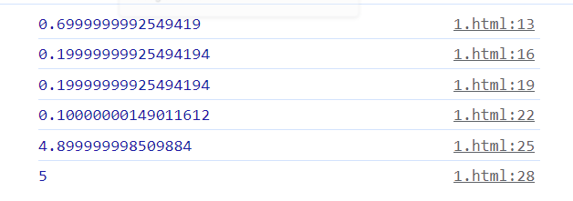
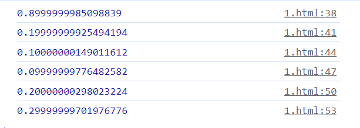

## 如何实现比 setTimeout 快 80 倍的定时器？
很多人都知道，setTimeout 是有最小延迟时间的，根据 MDN 文档 setTimeout：实际延时比设定值更久的原因：最小延迟时间 中所说：
```js
在浏览器中，setTimeout()/setInterval() 的每调用一次定时器的最小间隔是 4ms，
这通常是由于函数嵌套导致（嵌套层级达到一定深度）。
```

简单来说，5 层以上的定时器嵌套会导致至少 4ms 的延迟。
用如下代码做个测试：
```js
let a = performance.now();
setTimeout(() => {
  let b = performance.now();
  console.log(b - a);
  setTimeout(() => {
    let c = performance.now();
    console.log(c - b);
    setTimeout(() => {
      let d = performance.now();
      console.log(d - c);
      setTimeout(() => {
        let e = performance.now();
        console.log(e - d);
        setTimeout(() => {
          let f = performance.now();
          console.log(f - e);
          setTimeout(() => {
            let g = performance.now();
            console.log(g - f);
          }, 0);
        }, 0);
      }, 0);
    }, 0);
  }, 0);
}, 0);
```
在浏览器中的打印结果大概是这样的，和规范一致，第五次执行的时候延迟来到了 4ms 以上。


## 用 postMessage 来实现真正 0 延迟的定时器：
```js
(function () {
  var timeouts = [];
  var messageName = 'zero-timeout-message';

  // 保持 setTimeout 的形态，只接受单个函数的参数，延迟始终为 0。
  function setZeroTimeout(fn) {
    timeouts.push(fn);
    window.postMessage(messageName, '*');
  }

  function handleMessage(event) {
    if (event.source == window && event.data == messageName) {
      event.stopPropagation();
      if (timeouts.length > 0) {
        var fn = timeouts.shift();
        fn();
      }
    }
  }

  window.addEventListener('message', handleMessage, true);

  // 把 API 添加到 window 对象上
  window.setZeroTimeout = setZeroTimeout;
})();
```
于 postMessage 的回调函数的执行时机和 setTimeout 类似，都属于宏任务，所以可以简单利用 postMessage 和 addEventListener('message') 的消息通知组合，来实现模拟定时器的功能。
这样，执行时机类似，但是延迟更小的定时器就完成了。
再利用上面的嵌套定时器的例子来跑一下测试：
```js
  let a = performance.now();
    setZeroTimeout(() => {
        let b = performance.now();
        console.log(b - a);
        setZeroTimeout(() => {
          let c = performance.now();
          console.log(c - b);
          setZeroTimeout(() => {
            let d = performance.now();
            console.log(d - c);
            setZeroTimeout(() => {
              let e = performance.now();
              console.log(e - d);
              setZeroTimeout(() => {
                let f = performance.now();
                console.log(f - e);
                setZeroTimeout(() => {
                  let g = performance.now();
                  console.log(g - f);
                });
              });
            });
          });
        });
      });
```


### 全部在 0.1 ~ 0.3 毫秒级别，而且不会随着嵌套层数的增多而增加延迟。

从理论上来说，由于 postMessage 的实现没有被浏览器引擎限制速度，一定是比 setTimeout 要快的。但空口无凭，咱们用数据说话。
设计了一个实验方法，就是分别用 postMessage 版定时器和传统定时器做一个递归执行计数函数的操作，看看同样计数到 100 分别需要花多少时间。

```js
function runtest() {
  var output = document.getElementById('output');
  var outputText = document.createTextNode('');
  output.appendChild(outputText);
  function printOutput(line) {
    outputText.data += line + '\n';
  }

  var i = 0;
  var startTime = Date.now();
  // 通过递归 setZeroTimeout 达到 100 计数
  // 达到 100 后切换成 setTimeout 来实验
  function test1() {
    if (++i == 100) {
      var endTime = Date.now();
      printOutput(
        '100 iterations of setZeroTimeout took ' +
          (endTime - startTime) +
          ' milliseconds.'
      );
      i = 0;
      startTime = Date.now();
      setTimeout(test2, 0);
    } else {
      setZeroTimeout(test1);
    }
  }

  setZeroTimeout(test1);

  // 通过递归 setTimeout 达到 100 计数
  function test2() {
    if (++i == 100) {
      var endTime = Date.now();
      printOutput(
        '100 iterations of setTimeout(0) took ' +
          (endTime - startTime) +
          ' milliseconds.'
      );
    } else {
      setTimeout(test2, 0);
    }
  }
}
runtest()
```


实验代码很简单，先通过 setZeroTimeout 也就是 postMessage 版本来递归计数到 100，然后切换成 setTimeout 计数到 100。
可以看到快了很多