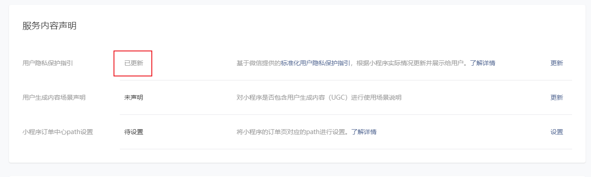
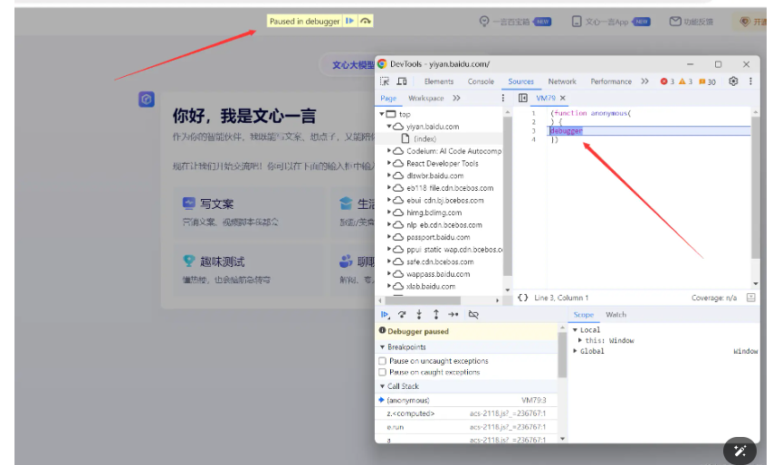
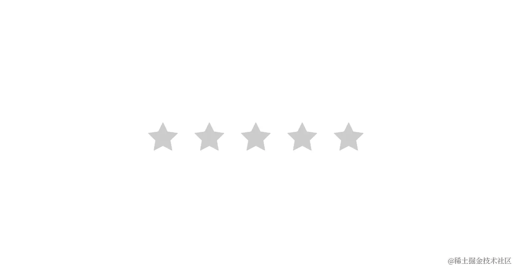
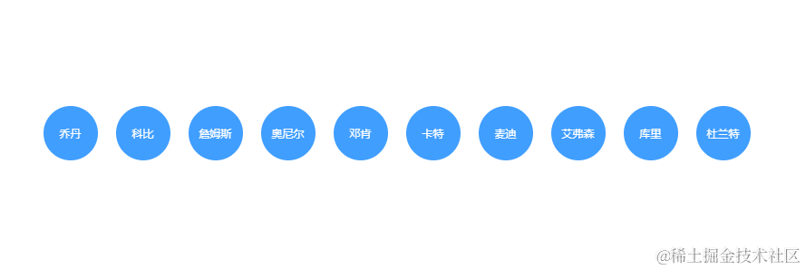

## saveImageToPhotosAlbum API

```js
  wx.saveImageToPhotosAlbum({
            filePath: tempFilePath,
            success: function () {
              console.log('图片保存成功');
              wx.showToast({
                title: '保存成功',
                icon: 'success',
                duration: 1000,
                success: function() {
                  wx.navigateBack();
                }
              });
            }
          });
```
保存失败原因：小程序设置页更新指引


开发环境不报错，正式环境报错

## uniapp canvas旋转图片问题

```html
 <canvas class="mycanvas" @touchstart="touchstart" @touchmove="touchmove" @touchend="touchend" canvas-id="handWriting" />
<canvas :style="{width:cavWidth +'px',height:cavWHeight +'px',position:'absolute',top:'200%'}" canvas-id="handWriting2" />
```
```js
 uni.getImageInfo({
            src: path,
            success: (info) => {
              const width = info.width;
              const height = info.height;
              this.cavWHeight = width
              this.cavWidth = height
              const ctx = uni.createCanvasContext('handWriting2',this);
              ctx.translate(height / 2 ,width / 2);
              ctx.rotate(-90 * Math.PI / 180); 
              ctx.drawImage(path,  - width / 2, - height / 2, width, height);
              ctx.draw()
              let that = this
              setTimeout(()=>{
                    uni.canvasToTempFilePath({
                        canvasId: 'handWriting2',
                        fileType: 'png',
                        quality: 1,
                        success(res2) {
                        console.log(res2)
                        that.signSrc = res2.tempFilePath 
                        that.$emit("getImgBase64preview",res2.tempFilePath)
                      }
                  },that)
                },200)
            }
          })
```
通过 :style="{width:cavWidth +'px',height:cavWHeight +'px',position:'absolute',top:'200%'}" 动态设置第二个canvas宽高，就能正确画上。
失败原因：不设宽高默认宽高是300X300,签名弹框是1200X600,旋转重新绘制之后大小不够导致只将空白页面绘制上去了


## 禁止调试，阻止浏览器F12开发者工具



文心一言打开调试出现debugger,关闭就跳到空白页，想看到可以使用开发者工具Ctrl+F8禁用断点调试

### 实现
debugger本身只是调试，阻止你继续对前端进行调试，但是代码中并不知道用户是否打开了开发者工具，所以就无法进行更进一步的操作，例如文心一言的跳转到空白页。
但是，有一点，你打开开发者工具之后，debugger下了断点，程序就停到那里了，如果你不打开开发者工具，程序是不会停止到断点的。没错，这就是我们可以判断的方式，时间间隔。正常情况下debugger前后的时间间隔可以忽略不计。但是，当你打开开发者工具之后，这个时间间隔就产生了，判断这个时间间隔，就可以知道是否打开了开发者工具。

### 代码
```js
<!DOCTYPE html>
<html>
    <header>
        <title>test</title>
    </header>
    <body>
        <h1>test</h1>
    </body>
    <script>
        setInterval(function() {

            var startTime = performance.now();
          	// 设置断点
            debugger; 
            var endTime = performance.now();
           	// 设置一个阈值，例如100毫秒
            if (endTime - startTime > 100) {
                window.location.href = 'about:blank';
            } 
            
        }, 100);

    </script>

</html>
```
通过设置一个定时循环任务来进行检测。


## CSS :has() 选择器
CSS 函数式伪类  :has()  表示一个元素，如果作为参数传递的任何相对选择器在锚定到该元素时，至少匹配一个元素。这个伪类通过把可容错相对选择器列表作为参数，提供了一种针对引用元素选择父元素或者先前的兄弟元素的方法。

:has() 选择器选择父元素和前面的兄弟元素

邻接兄弟选择器（+）用来选中恰好处于另一个在继承关系上同级的元素旁边的物件。例如，选中所有紧随<p>元素之后的元素：
```js
p + img
```

通用兄弟关系选择器（~）用来选中一个元素后面的所有兄弟元素。例如，选中<p>元素之后的所有的元素：
```js
p ~ img
```

css并没有提供直接选择父元素或者前面的兄弟元素的选择器，但 :has() 可以做到这点。
1、比如选择所有包含 <p>元素的父元素：
```js
:has(p)
```

2、选择直接后代元素包含 <p>元素的父元素：
```js
:has(> p)
```

3、选择直接后代元素包含 <p>元素的父级标签名是 div 父元素：
```js
div:has(> p)
```

4、选择 <p>元素的相邻的前一个标签名是 div 的兄弟元素:
```js
div:has(+ p)
```

5、选择 <p>元素的前面所有标签名是 div 的兄弟元素:
```cjs
div:has(~ p)
```

## 实现效果

### 示例
::: demo 示例
```vue
<template>
 <div>
    <input type="radio" name="radio" id="radio1">
    <label for="radio1">
      <svg xmlns="http://www.w3.org/2000/svg" viewBox="0 0 1024 1024" style=""><path fill="currentColor" d="M283.84 867.84 512 747.776l228.16 119.936a6.4 6.4 0 0 0 9.28-6.72l-43.52-254.08 184.512-179.904a6.4 6.4 0 0 0-3.52-10.88l-255.104-37.12L517.76 147.904a6.4 6.4 0 0 0-11.52 0L392.192 379.072l-255.104 37.12a6.4 6.4 0 0 0-3.52 10.88L318.08 606.976l-43.584 254.08a6.4 6.4 0 0 0 9.28 6.72z"></path></svg>
    </label>
    <input type="radio" name="radio" id="radio2">
    <label for="radio2">
      <svg xmlns="http://www.w3.org/2000/svg" viewBox="0 0 1024 1024" style=""><path fill="currentColor" d="M283.84 867.84 512 747.776l228.16 119.936a6.4 6.4 0 0 0 9.28-6.72l-43.52-254.08 184.512-179.904a6.4 6.4 0 0 0-3.52-10.88l-255.104-37.12L517.76 147.904a6.4 6.4 0 0 0-11.52 0L392.192 379.072l-255.104 37.12a6.4 6.4 0 0 0-3.52 10.88L318.08 606.976l-43.584 254.08a6.4 6.4 0 0 0 9.28 6.72z"></path></svg>
    </label>
    <input type="radio" name="radio" id="radio3">
    <label for="radio3">
      <svg xmlns="http://www.w3.org/2000/svg" viewBox="0 0 1024 1024" style=""><path fill="currentColor" d="M283.84 867.84 512 747.776l228.16 119.936a6.4 6.4 0 0 0 9.28-6.72l-43.52-254.08 184.512-179.904a6.4 6.4 0 0 0-3.52-10.88l-255.104-37.12L517.76 147.904a6.4 6.4 0 0 0-11.52 0L392.192 379.072l-255.104 37.12a6.4 6.4 0 0 0-3.52 10.88L318.08 606.976l-43.584 254.08a6.4 6.4 0 0 0 9.28 6.72z"></path></svg>
    </label>
    <input type="radio" name="radio" id="radio4">
    <label for="radio4">
      <svg xmlns="http://www.w3.org/2000/svg" viewBox="0 0 1024 1024" style=""><path fill="currentColor" d="M283.84 867.84 512 747.776l228.16 119.936a6.4 6.4 0 0 0 9.28-6.72l-43.52-254.08 184.512-179.904a6.4 6.4 0 0 0-3.52-10.88l-255.104-37.12L517.76 147.904a6.4 6.4 0 0 0-11.52 0L392.192 379.072l-255.104 37.12a6.4 6.4 0 0 0-3.52 10.88L318.08 606.976l-43.584 254.08a6.4 6.4 0 0 0 9.28 6.72z"></path></svg>
    </label>
    <input type="radio" name="radio" id="radio5">
    <label for="radio5">
      <svg xmlns="http://www.w3.org/2000/svg" viewBox="0 0 1024 1024" style=""><path fill="currentColor" d="M283.84 867.84 512 747.776l228.16 119.936a6.4 6.4 0 0 0 9.28-6.72l-43.52-254.08 184.512-179.904a6.4 6.4 0 0 0-3.52-10.88l-255.104-37.12L517.76 147.904a6.4 6.4 0 0 0-11.52 0L392.192 379.072l-255.104 37.12a6.4 6.4 0 0 0-3.52 10.88L318.08 606.976l-43.584 254.08a6.4 6.4 0 0 0 9.28 6.72z"></path></svg>
    </label>
  </div>
</template>
 <script>
  export default {
   
  }
  </script>
<style lang="less">
 div{
  width:300px;
  display:flex;
  /* 从右往左排列 */
/*   flex-direction:row-reverse; */
  justify-content:space-around;
}
input{
  display:none;
}
input:checked + label{
  color:gold;
}
/* 点击星级时，点亮当前选择的之前所有的星级 */
div:has(input:checked) label:not(input:checked ~ label){
  color:gold;
}

label{
  display:inline-block;
  width:50px;height:50px;
  border-radius:50%;
  color:#ccc;
  transition:all ease 0.2s;
}
label:hover{
  cursor:pointer;
  color:gold;
  & ~ label{
    color:#ccc!important;
  }
}

/* 点亮当前hover之前的所有星级 */
div:has(label:hover) label:not(:hover,:hover ~ *){
  color:gold;
}
</style>
:::

## 实现效果

### 示例
::: demo 示例
```vue
<template>
 <div class="box">
  <div class="son">乔丹</div>
  <div class="son">科比</div>
  <div class="son">詹姆斯</div>
  <div class="son">奥尼尔</div>
  <div class="son">邓肯</div>
  <div class="son">卡特</div>
  <div class="son">麦迪</div>
  <div class="son">艾弗森</div>
  <div class="son">库里</div>
  <div class="son">杜兰特</div>
</div>
</template>
 <script>
  export default {
   
  }
  </script>
<style lang="less">
     body{
  width:100%;
  display:flex;
  justify-content:center;
  align-items:center;
}

.box{
  margin-top:10rem;
  display:flex;
  justify-content:center;
  align-items:center;
  .son{
    display:flex;
    justify-content:center;
    align-items:center;
    width:40px;
    height:40px;
    margin:10px;
    padding:10px;
    border-radius:50%;
    background-color:#409eff;
    color:#fff;
    cursor:pointer;
    font-size:12px;
    transition:all ease 0.2s;
    &:hover{
      background-color:#67c23a;
      transform:scale(1.4);
      & + .son{
        /*  后一个相邻的兄弟元素 */
        transform:scale(1.1); 
      }
    }
  }
}

/* 选择存在 后一个相邻的被hover的兄弟元素 的元素 */
.son:has( + .son:hover){
  transform:scale(1.2);
}

/* // .box:has(.son:hover) => 选择box下的被hover的son元素
// .son:not(:hover, :has(+ :hover), .son:hover + *) => 排除son元素里面被hover的元素，被hover的元素的前一个邻接的兄弟元素，被hover的元素的后一个邻接的兄弟元素； */
.box:has(.son:hover) .son:not(:hover, :has(+ :hover), .son:hover + *) {
  transform:scale(0.8);
  opacity:0.7;
}
</style>
:::