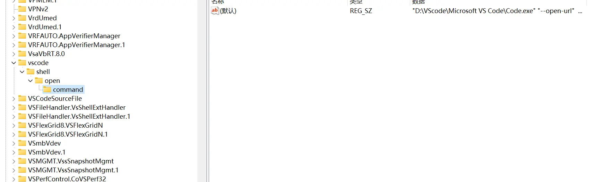
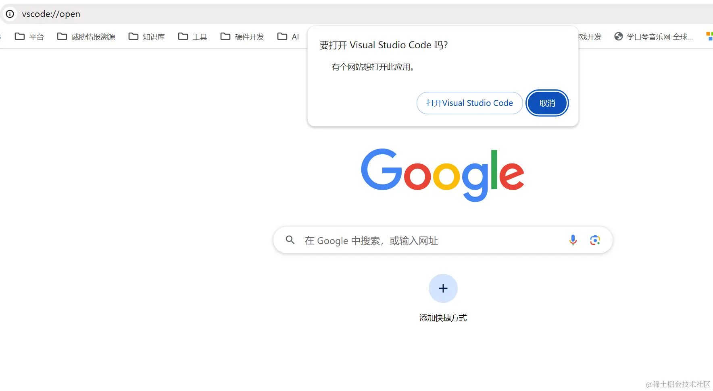

## 1前端项目部署后提醒正在访问的用户刷新页面
测试提了个bug，我们修改好后重新部署到环境上了，让测试去测下，测试有时会说，不是，哥们，咋还是有问题呢，你确定处理好了？你可能就会说，刷新下页面再试下呢。刷新，okok，可以了。    
### 实现思路
打开网站、或刷新网站时，读取网站资源的Etag或last-modify信息，使用临时变量存储，这命名为preTag
设置一个定时器，每间隔多少秒，重新 读取取网站资源的Etag或last-modify信息，这命名为curTag
对比preTag和curTag；如果不相等，则弹出提示信息，提醒用户有版本更新，请用户刷新页面
### 代码实现
```js
import { ElNotification } from "element-plus";

const LOOPER_TIME = 5 * 1000; // 检测版本更新的轮训时间

let preTag: string | null; // 用于记录初次进入网站或网站被刷新时的Etag信息

if (process.env.NODE_ENV !== "development") {
  // 只在生成环境生效
  (async () => {
    preTag = await getTag();

    // 每隔一段时间获取一遍网站的etag信息，与preTag做对比，如果不一样，则证明有版本更新
    const interval = setInterval(async () => {
      const curTag = await getTag();
      if (preTag !== curTag) {
        showNotification();
        clearInterval(interval);
        preTag = curTag
      }
    }, LOOPER_TIME);
  })()
}

/**
 * 检测到版本更新后，notification会一直显示在页面上
 */
function showNotification(): void {
  ElNotification({
    showClose: false,
    duration: 0,
    title: "版本更新提示",
    dangerouslyUseHTMLString: true,
    message:
      "检测到有新版本发布，请<a href='javascript:location.reload()'>刷新</a>页面",
  });
}

/**
 * 获取网站资源的Etag信息
 *
 * @returns 网站资源的Etag信息
 */
async function getTag(): Promise<string | null> {
  const response = await fetch(window.location.origin, {
    method: "HEAD", // 用于获取资源的元数据，与GET请求类似，HEAD请求也像服务器发送请求，但服务器只需要回传资源的头部信息，不需要回传资源的实体主体。
    cache: "no-cache",
  });
  return response.headers.get("Etag") || response.headers.get("last-modified");
}
```

## 2前端性能优化：劫持Promise
```js
import isEqual from 'lodash/isEqual';

function promiseHijack(promiseFn, options = { isEqual: isEqual }) {
  const pendingMap = new Map();

  return function (...args) {
    const targetArguments = Array.from(pendingMap.keys()).find(key => options.isEqual(key, args));
    const targetValue = pendingMap.get(targetArguments);

    if (targetArguments && targetValue) {
      return new Promise((resolve, reject) => {
        targetValue.push({ resolve, reject });
      });
    }

    return new Promise((resolve, reject) => {
      pendingMap.set(args, [{ resolve, reject }]);
    }).then(() => {
      promiseFn.apply(null, args).then(
        value => {
          targetValue.forEach(({ resolve }) => resolve(value));
          pendingMap.delete(args);
        },
        error => {
          targetValue.forEach(({ reject }) => reject(error));
          pendingMap.delete(args);
        }
      );
    });
  };
}
export default promiseHijack;
```
### 使用
模拟耗时的promise操作
```js
const delay = ms => new Promise(resolve => setTimeout(() => resolve(), ms));

let count = 1;
const mockApi = async (name) => {
    console.log("👻 ~ mockApi ~ running");
    await delay(1000);
    return `${name}-timestamp-${count++}`
}
```
1、被劫持的情况  
不使用promiseHijack
```js
count = 1;
mockApi().then((data) => console.log("mockApi_1:", data));
mockApi().then((data) => console.log("mockApi_2:", data));
mockApi().then((data) => console.log("mockApi_3:", data));

// 👻 ~ mockApi ~ running
// 👻 ~ mockApi ~ running
// 👻 ~ mockApi ~ running

// mockApi_1: undefined-timestamp-1
// mockApi_2: undefined-timestamp-2
// mockApi_3: undefined-timestamp-3
```
使用promiseHijack
```js
count = 1;
const hijackedMockApi = promiseHijack(mockApi);
hijackedMockApi().then((data) => console.log("hijackedMockApi_1:", data));
hijackedMockApi().then((data) => console.log("hijackedMockApi_2:", data));
hijackedMockApi().then((data) => console.log("hijackedMockApi_3:", data));

// 👻 ~ mockApi ~ running

// hijackedMockApi_1: undefined-timestamp-1
// hijackedMockApi_2: undefined-timestamp-1
// hijackedMockApi_3: undefined-timestamp-1
```
分析：  
未使用promiseHijack时，mockApi被执行了三次，三次promise请求的结果都不相同  
使用promiseHijack后，mockApi仅被执行了一次，三次promise请求共用了首个promise的结果  

## 3网页如何唤醒本地应用
配置自定义协议  
这里我用VS Code来举例子，最终我要实现通过浏览器打开我电脑上的VS Code。 
首先通过注册表查找

这时，我们打开浏览器，输入 vscode://open


可以看到，就像百度网盘一样，浏览器弹出了询问对话框，然后就可以打开VS Code了。  
如果想要在网页上进行打开，也简单
```js
<script>
  function openVSCode() {
    window.location.href = 'vscode://open/';
  }
</script>
<button onclick="openVSCode()">打开 VSCode</button>
```