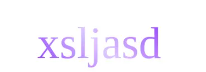

## 一、Vue3.5正式上线，父传子props用法更丝滑简洁
### 1带响应式Props解构赋值

保留响应式的老写法，使用toRefs或者toRef解构
```js
<template>
  <div>
    {{ testCount }}
  </div>
</template>

<script setup>
  import { defineProps, toRef, toRefs } from 'vue';
  const props = defineProps({
    testCount: {
      type: Number,
      default: 0,
    },
  });

  const { testCount } = toRefs(props);
  // 或者
  const testCount = toRef(props, 'testCount');
</script>
```

最新Vue3.5写法，不借助”外力“直接解构，依然保持响应式
```js
<template>
  <div>
    {{ testCount }}
  </div>
</template>

<script setup>
  import { defineProps } from 'vue';
  const { testCount } = defineProps({
    testCount: {
      type: Number,
    },
  });

</script>
```
相比以前简洁了真的太多，直接解构使用省去了toRefs或者toRef

### 二、Props默认值新写法
旧写法
```js
<template>
  <div>
    {{ props.testCount }}
  </div>
</template>

<script setup>
  import { defineProps } from 'vue';
  const props = defineProps({
    testCount: {
      type: Number,
      default: 1
    },
  });
</script>

```
新写法
```js
<template>
  <div>
    {{ testCount }}
  </div>
</template>

<script setup>
  import { defineProps } from 'vue';
  const { testCount=18 } = defineProps({
    testCount: {
      type: Number,
    },
  });
</script>

```

## 二、几个css技巧
### 1、resize 属性
```js
/* Keyword values */
resize: none;
resize: both;
resize: horizontal;
resize: vertical;
resize: block;
resize: inline; 

/* Global values */
resize: inherit;
resize: initial;
resize: revert;
resize: revert-layer;
resize: unset;
```
使用这个属性我们可以让用户在页面上自定义元素的宽高，在我们使用了resize:both后，用户就可以拖拽元素边缘，对元素进行拉伸和压缩的操作。
```js
    textarea {
      resize: both; /* 允许水平和垂直调整大小 */
    }
```
resize不能在内联元素中使用，也不能在overflow: visible的元素中使用。

### 2、不使用js的样式控制
```js
<input type="checkbox" name="test" id="testCheckBox">
<label for="testCheckBox">test</label>
<div class="container">隐藏内容</div>

.container {  
    display:none;
}
#testCheckBox:checked ~ .container {
  display:flex;
  margin:16px;
  border:1px gray solid;
  width:200px;  height:48px;
  align-items:center;
  justify-content:center;
}
#testCheckBox {
    display:none;
}
```

### 3、CSS实现扫光效果
有时候，为了凸显某些元素或文字，我们需要添加一些扫光效果。我们可以使用css动画来实现这一点。接下来以文本为例子进行演示：
```js
 <h1 class="shining-text">彩色文字扫光效果</h1>
  .shining-text {
      font-size: 4rem; /* 字体大小 */
      background:linear-gradient(45deg,rgba(255,255,255,0)40%,rgba(255,255,255,0.7),rgba(255,255,255,0)60%);
      background-size: 300% 100%; /* 设置背景大小 */
      background-position: -200% 0; /* 初始位置 */
      background-clip: text;
      -webkit-background-clip: text; /* Safari 支持 */
      color: transparent; /* 文字透明 */
      animation: shine 2s infinite; /* 动画效果 */
    }

    @keyframes shine {
      from {
        background-position: -200% 0; /* 初始位置 */
      }
      to {
        background-position: 200% 0; /* 结束位置 */
      }
    }
```


### 4、css样式网站 <a href="https://uiverse.io">https://uiverse.io</a>
