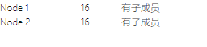
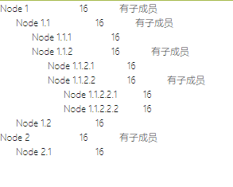

## 有时候我们会遇到这样一个场景,就是一个多层数据的数组需要分层级展示
例如这样的数据
```js
 [
  {
    id: 1,
    name: 'Node 1',
    age:16,
    children: [
      {
        id: 2,
        name: 'Node 1.1',
        age:16,
        children: [
          {
            id: 3,
            name: 'Node 1.1.1',
            age:16,
          },
          {
            id: 4,
            name: 'Node 1.1.2',
            age:16,
            children: [
            {
              id: 8,
              name: 'Node 1.1.2.1',
              age:16,
            },
            {
              id: 9,
              name: 'Node 1.1.2.2',
              age:16,
              children: [
                {
                  id: 10,
                  name: 'Node 1.1.2.2.1',
                  age:16,
                },
                {
                  id: 11,
                  name: 'Node 1.1.2.2.2',
                  age:16,
                }
              ]
            }
          ]
          }
        ]
      },
      {
        id: 5,
        name: 'Node 1.2',
        age:16,
      }
    ]
  },
  {
    id: 6,
    name: 'Node 2',
    age:16,
    children:[
      {
        id: 7,
        name: 'Node 2.1',
        age:16,
      }
    ]
  }
]
```
当然,有些ui组件也可以实现,但是可能有时候组件不一定适用我们的场景
所以这里介绍适用tree组件递归调用自身实现

## 定义tree组件
```js
<template>
  <div class="items">
      <div class="item" v-for="node in nodes" :key="node.id">
        <span class="first"> {{ node.name }} </span>
        <span class="second"> {{ node.age }} </span>
        <span v-if="node.children" @click="show(node.children)">有子成员</span>
        <tree class="itemson" :nodes="node.children" v-if="node.children&&node.children.isShow" />
      </div>
  </div>
</template>

<script setup>
import { defineProps } from 'vue'

const props = defineProps({
  nodes: {
    type: Array,
    default: () => []
  }
})
const show = function(item){
    console.log(item)
    item.isShow = !item.isShow
}
</script>
<style lang="scss" scoped>
.items{
  .item{
    .first{
      display: inline-block;
      width: 100px;
    }
    .second{
      display: inline-block;
      width: 50px;
    }
    .itemson{
      margin-left: 20px;
    }
  }
}
</style>
```
tree组件只接收nodes数据进行遍历,如果还有children就递归调用tree

## 使用tree组件
```js
<template>
  <div>
    <tree :nodes="nodes" />
  </div>
</template>

<script setup>
import { reactive } from 'vue'
import Tree from './Tree.vue'

const nodes = reactive(
  [
  {
    id: 1,
    name: 'Node 1',
    age:16,
    children: [
      {
        id: 2,
        name: 'Node 1.1',
        age:16,
        children: [
          {
            id: 3,
            name: 'Node 1.1.1',
            age:16,
          },
          {
            id: 4,
            name: 'Node 1.1.2',
            age:16,
            children: [
            {
              id: 8,
              name: 'Node 1.1.2.1',
              age:16,
            },
            {
              id: 9,
              name: 'Node 1.1.2.2',
              age:16,
              children: [
                {
                  id: 10,
                  name: 'Node 1.1.2.2.1',
                  age:16,
                },
                {
                  id: 11,
                  name: 'Node 1.1.2.2.2',
                  age:16,
                }
              ]
            }
          ]
          }
        ]
      },
      {
        id: 5,
        name: 'Node 1.2',
        age:16,
      }
    ]
  },
  {
    id: 6,
    name: 'Node 2',
    age:16,
    children:[
      {
        id: 7,
        name: 'Node 2.1',
        age:16,
      }
    ]
  }
]
)
</script>

<script>
export default{
  components: {
    Tree
  },
}
</script>
```
使用方式就是定义一个nodes数据并将其传给tree组件

## 效果图
### 未展开


### 展开
