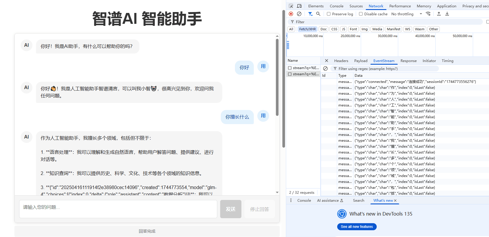

# 前言
目前很火的ai的api接入，最近找了个免费的ai,叫智普ai,服务端使用node,前端使用vue

## 首先是node端
1.质普ai的key自己去申请
```js
// API类型
export type ApiType = 'huggingface' | 'zhipuai' | 'openai';

// 配置选项
export interface ApiConfig {
  name: string;
  url: string;
  apiKey: string;
  model: string;
  headers: Record<string, string>;
  dataFormatter: (question: string) => any;
  responseParser: (data: any) => string | null;
}

// 选择当前使用的API
export const CURRENT_API: ApiType = 'zhipuai';
// 智谱AI配置 (需要注册)
export const zhipuaiConfig: ApiConfig = {
  name: '智谱AI',
  url: 'https://open.bigmodel.cn/api/paas/v4/chat/completions',
  apiKey: '', // 在智谱AI官网注册并获取API密钥: https://open.bigmodel.cn/
  model: 'glm-4',
  headers: {
    'Content-Type': 'application/json',
    'Authorization': '' // 会在运行时自动填充
  },
  dataFormatter: (question: string) => ({
    model: 'glm-4',
    messages: [
      {
        role: "user",
        content: question
      }
    ],
    stream: true
  }),
  responseParser: (data: any) => {
    return data.choices?.[0]?.delta?.content || null;
  }
};
...
// 获取当前配置
export function getCurrentConfig(): ApiConfig {
  let config: ApiConfig;
  
  switch (CURRENT_API) {
    case 'huggingface':
      config = huggingfaceConfig;
      break;
    case 'zhipuai':
      config = zhipuaiConfig;
      break;
    case 'openai':
      config = openaiConfig;
      break;
    default:
      config = huggingfaceConfig;
  }
  
  // 设置认证头
  config.headers['Authorization'] = `Bearer ${config.apiKey}`;
  
  return config;
} 
```
工具类，获取当前的配置  
2.编写接口接入智谱AI
```js
import express from 'express';
import cors from 'cors';
import axios from 'axios';
import { getCurrentConfig } from './config.js';

const app = express();
const port = 3000;

// 启用 CORS
app.use(cors());
app.use(express.json());

......

// 存储当前活动的请求
const activeRequests = new Map<string, AbortController>();


// 流式接口
app.get('/api/stream', async (req, res) => {
  // 获取用户问题
  const userQuestion = req.query.q as string || '请介绍一下你自己';
  const sessionId = req.query.sessionId as string || Date.now().toString();
  
  console.log('收到新的流式请求，sessionId:', sessionId);
  console.log('问题:', userQuestion);
  
  // 设置SSE相关的响应头
  res.setHeader('Content-Type', 'text/event-stream');
  res.setHeader('Cache-Control', 'no-cache');
  res.setHeader('Connection', 'keep-alive');
  
  // 发送初始连接成功消息
  res.write(`data: ${JSON.stringify({ type: 'connected', message: '连接成功', sessionId })}\n\n`);
  
  try {
    // 获取当前API配置
    const apiConfig = getCurrentConfig();
    
    // 如果没有设置API密钥，使用备用响应
    if (!apiConfig.apiKey || apiConfig.apiKey.includes('请替换')) {
      console.error(`${apiConfig.name} API密钥未正确配置，请在config.ts中设置`);
      throw new Error('API密钥未配置');
    }
    
    console.log(`使用${apiConfig.name}接口发送请求`);
    
    // 构建请求数据
    const requestData = apiConfig.dataFormatter(userQuestion);
    
    // 创建AbortController用于中断请求
    const controller = new AbortController();
    activeRequests.set(sessionId, controller);
    
    // 发起流式请求
    const response = await axios.post(apiConfig.url, requestData, {
      headers: apiConfig.headers,
      responseType: 'stream',
      timeout: 10000,
      signal: controller.signal
    });
    
    // 处理流式响应
    response.data.on('data', (chunk: Buffer) => {
      // 解析数据块
      const lines = chunk.toString().split('\n');
      for (const line of lines) {
        // 跳过空行和结束标记
        if (!line.trim() || line.trim() === 'data: [DONE]') continue;
        
        try {
          // 移除"data: "前缀(如果有)
          const cleanedLine = line.startsWith('data: ') ? line.slice(6) : line;
          
          // 尝试解析JSON
          try {
            const data = JSON.parse(cleanedLine);
            
            // 使用配置的解析器提取内容
            const content = apiConfig.responseParser(data);
            
            if (content) {
              // 逐字符发送给客户端
              for (const char of content) {
                const message = {
                  type: 'char',
                  char,
                  index: 0,
                  isLast: false
                };
                
                res.write(`data: ${JSON.stringify(message)}\n\n`);
              }
            }
          } catch (e) {
            // 如果无法解析为JSON，可能是非标准格式，直接作为文本处理
            if (cleanedLine && cleanedLine !== '[DONE]') {
              // 逐字符发送给客户端
              for (const char of cleanedLine) {
                const message = {
                  type: 'char',
                  char,
                  index: 0,
                  isLast: false
                };
                
                res.write(`data: ${JSON.stringify(message)}\n\n`);
              }
            }
          }
        } catch (error) {
          console.error('解析SSE消息错误:', error);
        }
      }
    });
    
    // 处理请求完成
    response.data.on('end', () => {
      activeRequests.delete(sessionId);
      // 发送完成消息并关闭连接
      res.write(`data: ${JSON.stringify({ type: 'complete', message: '回答完成' })}\n\n`);
      res.end();
    });
    
    // 处理错误
    response.data.on('error', (error: Error) => {
      activeRequests.delete(sessionId);
      console.error('流式请求错误:', error);
      res.write(`data: ${JSON.stringify({ type: 'error', message: '请求出错' })}\n\n`);
      res.end();
    });
    
  } catch (error) {
    activeRequests.delete(sessionId);
    console.error('API请求错误:', error);
    
    // 获取当前API配置
    const apiConfig = getCurrentConfig();
    
    // 使用备用响应
    const fallbackResponse = `抱歉，AI服务暂时不可用。当前使用的是${apiConfig.name}接口，请检查：
1. API密钥是否正确配置
2. 网络连接是否正常
3. 服务器是否可访问`;
    
    // 逐字符发送备用响应
    for (let i = 0; i < fallbackResponse.length; i++) {
      const message = {
        type: 'char',
        char: fallbackResponse[i],
        index: i,
        isLast: i === fallbackResponse.length - 1
      };
      
      res.write(`data: ${JSON.stringify(message)}\n\n`);
      
      // 添加延迟以模拟打字效果
      await new Promise(resolve => setTimeout(resolve, 100));
    }
    
    // 发送完成消息并关闭连接
    res.write(`data: ${JSON.stringify({ type: 'complete', message: '回答完成' })}\n\n`);
    res.end();
  }
  
  // 当客户端断开连接时处理
  req.on('close', () => {
    activeRequests.delete(sessionId);
    console.log('客户端已断开连接');
  });
});

// 中断当前回答
app.post('/api/interrupt', (req, res) => {
  const sessionId = req.query.sessionId as string;
  console.log('收到中断请求，sessionId:', sessionId);
  console.log('当前活动请求:', Array.from(activeRequests.keys()));
  
  if (sessionId && activeRequests.has(sessionId)) {
    const controller = activeRequests.get(sessionId);
    controller?.abort();
    activeRequests.delete(sessionId);
    console.log('成功中断会话:', sessionId);
    res.json({ success: true, message: '已中断当前回答' });
  } else {
    console.log('未找到需要中断的会话:', sessionId);
    res.json({ success: false, message: '没有找到需要中断的会话' });
  }
});

app.listen(port, () => {
  console.log(`服务器已启动，端口: ${port}`);
});
```
node服务器编写了一个流式接口和一个控制中断流式的接口，  
通过const activeRequests = new Map<string, AbortController>();存储每个对话的sessionId,以便打断  

## 前端接收
主要使用EvenSource来接收
```js
<template>
  <div class="chat-container">
    <div class="chat-messages" ref="messagesContainer">
      <div v-for="(message, index) in messages" :key="index" :class="['message', message.role]">
        <div class="message-content">{{ message.content }}</div>
      </div>
      <div v-if="isTyping" class="message assistant">
        <div class="message-content">{{ currentResponse }}</div>
      </div>
    </div>
    <div class="chat-input">
      <input
        v-model="userInput"
        @keyup.enter="sendMessage"
        placeholder="输入消息..."
        :disabled="isTyping"
      />
      <button @click="sendMessage" :disabled="isTyping">发送</button>
      <button @click="interruptResponse" class="interrupt-btn">停止回答</button>
    </div>
  </div>
</template>
<script setup lang="ts">
import { ref, onUnmounted, nextTick } from 'vue';

const messages = ref<{ role: 'user' | 'assistant'; content: string }[]>([]);
const userInput = ref('');
const isTyping = ref(false);
const currentResponse = ref('');
const messagesContainer = ref<HTMLElement | null>(null);
const eventSource = ref<EventSource | null>(null);
const currentSessionId = ref<string | null>(null);

const scrollToBottom = async () => {
  await nextTick();
  if (messagesContainer.value) {
    messagesContainer.value.scrollTop = messagesContainer.value.scrollHeight;
  }
};

const sendMessage = async () => {
  if (!userInput.value.trim() || isTyping.value) return;
  
  const message = userInput.value;
  messages.value.push({ role: 'user', content: message });
  userInput.value = '';
  
  await scrollToBottom();
  
  // 设置状态
  isTyping.value = true;
  currentResponse.value = '';
  
  // 生成新的会话ID
  currentSessionId.value = Date.now().toString();
  
  // 关闭之前的连接
  if (eventSource.value) {
    eventSource.value.close();
  }
  
  // 创建新的SSE连接
  eventSource.value = new EventSource(`/api/stream?q=${encodeURIComponent(message)}&sessionId=${currentSessionId.value}`);
  
  eventSource.value.onmessage = (event) => {
    const data = JSON.parse(event.data);
    
    switch (data.type) {
      case 'connected':
        console.log('SSE连接成功');
        isTyping.value = true; // 确保连接成功后设置状态
        break;
      case 'char':
        currentResponse.value += data.char;
        scrollToBottom();
        break;
      case 'complete':
        messages.value.push({ role: 'assistant', content: currentResponse.value });
        currentResponse.value = '';
        isTyping.value = false;
        eventSource.value?.close();
        eventSource.value = null;
        break;
      case 'error':
        console.error('SSE错误:', data.message);
        isTyping.value = false;
        eventSource.value?.close();
        eventSource.value = null;
        break;
    }
  };
  
  eventSource.value.onerror = () => {
    console.error('SSE连接错误');
    isTyping.value = false;
    eventSource.value?.close();
    eventSource.value = null;
  };
};

const interruptResponse = async () => {
  if (!currentSessionId.value || !isTyping.value) return;
  
  try {
    const response = await fetch(`/api/interrupt?sessionId=${currentSessionId.value}`, {
      method: 'POST'
    });
    const data = await response.json();
    console.log('中断响应:', data);
    
    if (data.success) {
      // 将当前部分响应添加到消息列表
      if (currentResponse.value) {
        messages.value.push({ role: 'assistant', content: currentResponse.value });
      }
      currentResponse.value = '';
      isTyping.value = false;
      
      // 关闭SSE连接
      if (eventSource.value) {
        eventSource.value.close();
        eventSource.value = null;
      }
    }
  } catch (error) {
    console.error('中断请求失败:', error);
  }
};

onUnmounted(() => {
  if (eventSource.value) {
    eventSource.value.close();
  }
});
</script>
```
最终实现效果如图

