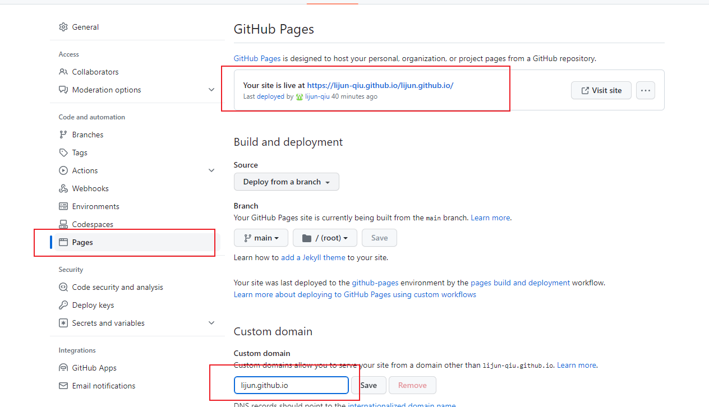

# 博客搭建
## 1vuepress-theme-reco搭建博客

### 1首先按照 Reco主题官网 的步骤，先部署到本地建议是新建一个Blog<b style="color:red;">(注意这里不能有中文文件夹，不然打包容易失败)</b>总文件夹后再在里面进行操作
````js
#npm
$ npm install @vuepress-reco/theme-cli -g
$ theme-cli init
````
### 2初始化并运行
````js
 npm install
 npm run dev
````

### 3简单介绍文件结构
docs
````js
$ ls -al
total 776
drwxr-xr-x   10 wuxiaoqi  staff     320  1 10 13:49 .
drwxr-xr-x    3 wuxiaoqi  staff      96  1 10 13:40 ..
-rw-r--r--    1 wuxiaoqi  staff      34 12 27 02:47 .gitignore
drwxr-xr-x    4 wuxiaoqi  staff     128  1 10 13:40 .vuepress
-rw-r--r--    1 wuxiaoqi  staff     727 12 27 02:47 README.md
drwxr-xr-x    5 wuxiaoqi  staff     160  1 10 13:40 blogs
drwxr-xr-x    3 wuxiaoqi  staff      96  1 10 13:40 docs
drwxr-xr-x  877 wuxiaoqi  staff   28064  1 10 13:49 node_modules
-rw-r--r--    1 wuxiaoqi  staff     309  1 10 13:40 package.json
-rw-r--r--    1 wuxiaoqi  staff  384855  1 10 13:49 yarn.lock
````
blogs 
````js
blogs
├── category1
│   ├── 2018
│   │   └── 121501.md
│   └── 2019
│       └── 092101.md
├── category2
│   ├── 2016
│   │   └── 121501.md
│   └── 2017
│       └── 092101.md
└── other
    └── guide.md
````

### 配置config.js文件
```js
base:'/lijun.github.io/',
```
1. <b style="color:red;">当前打包在public文件夹下，不设置base将获取不到资源,设置为/lijun.github.io/，访问地址为https://lijun-qiu.github.io/lijun.github.io，其中lijun-qiu.github.io为默认的，lijun.github.io是自己加的</b>

```js
 nav: [
      { text: "主页", link: "/", icon: "reco-home" },
      { text: "时间筛选", link: "/timeline/", icon: "reco-date" },
      {
        text: "博客",
        items: [{ text: "js", link: "/blogs/js/" }],
      },
      {
        text: "文档",
        icon: "reco-message",
        items: [{ text: "vuepress-reco", link: "/docs/theme-reco/" }],
      },
      {
        text: "Gitee",
        icon: "reco-message",
        items: [
          {
            text: "Gitee",
            link: "https://gitee.com/qlijn/my-blog",
            icon: "reco-github",
          },
        ],
      },
    ],

    sidebar: {
      "/docs/theme-reco/": ["", "theme", "plugin", "api", "blogbuild"],
      "/blogs/js/": ["", "测试"],
    },
```
<p style="color:red;">2.nav为顶上导航栏，通过items设置子属性，link为目标文件所在目录</p>
<p style="color:red;">3.sidebar设置顶部导航栏指定目录下的文件</p>
<p>4.还有博客标签设置等，可自行查找官网，基本配置完成</p>

## 发布到github

### 1新建github仓库，将打包文件提交上去

### 2设置pages


<p style="color:red;">此时访问地址<https://lijun-qiu.github.io/lijun.github.io/>就能看到效果</p>

## 自动提交github

### 1创建一个deploy.sh文件
```js
#!/usr/bin/env sh

# 确保脚本抛出遇到的错误
set -e

# 打包命令，生成静态文件
npm run build

# 进入生成的文件夹
cd public

#git命令
git init
git add .
git commit -m 'deploy'

# 发布到 https://<USERNAME>.github.io/<REPO>
git push -f https://github.com/lijun-qiu/lijun.github.io.git master

cd -
```
### 2运行deploy.sh

1. linux可以直接通过 sh deploy.sh运行
2. window可以在deploy.sh文件目录打开git窗口，输入./deploy.sh执行，也可以直接双击文件执行
