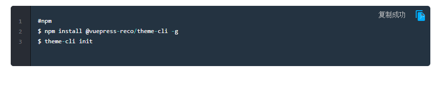

# vuepress博客系统添加代码复制功能

## 1安装插件
```js
$ npm install vuepress-plugin-code-copy
# OR
$ yarn add vuepress-plugin-code-copy
```

## 2config.js配置
```js
  plugins: [
    // ['@dovyp/vuepress-plugin-clipboard-copy', true],
    ["vuepress-plugin-code-copy", {
      align: 'top',
      color: '#27b1ff',
      backgroundTransition: true,
      backgroundColor: '#0075b8',
      successText: '复制成功'
    }
    ]
  ]
```

## 3效果


## 4详细配置解析
```js
selector
Type: String
Default: div[class*="language-"] pre
This is the CSS selector to which the copy button component will be attached.

align
Type: String
Default: bottom
Supported options: top and bottom
This option describes the vertical position of the copy button component as well as the successText

color
Type: String
Default: #27b1ff
This sets the color of the copy button and can take any hex code.

backgroundTransition
Type: Boolean
Default: true
Enables the background transition animation of the attached code block when a user presses the copy button.

backgroundColor
Type: String
Default: #0075b8
This sets the color of the background transition animation and can take any hex code.

successText
Type: String
Default: Copied!
        This sets the text that displays when a user presses the copy button.

staticIcon
Type: Boolean
Default: false
Copy icon is only visible when hovering over code block or is always visible.
```
## 4详情请看文档<https://github.com/znicholasbrown/vuepress-plugin-code-copy>
